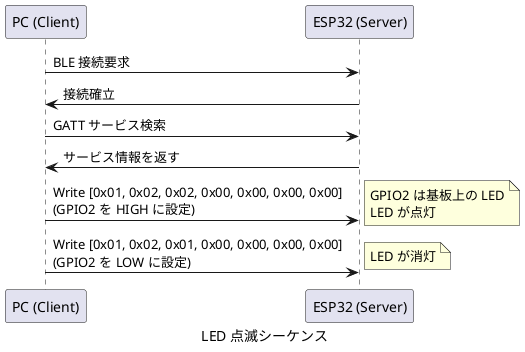
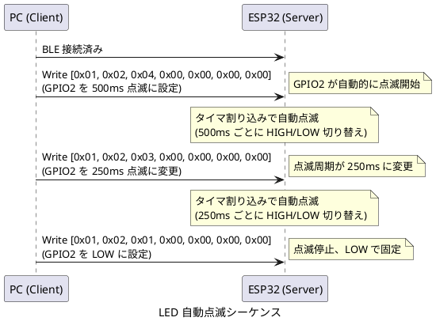
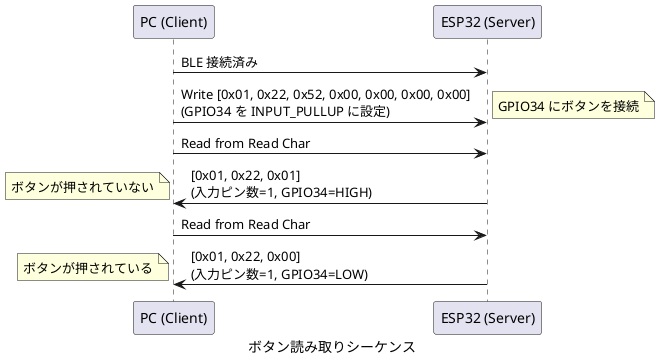
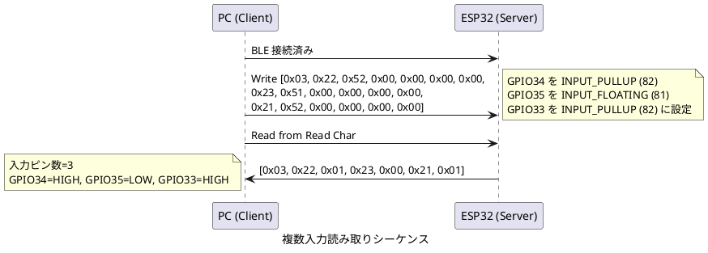

# BLEIO プロトコル仕様

本仕様は、ESP32-WROOM-32 を BLE ペリフェラル (周辺機器) として動作させ、PC などのセントラル (中心機器) から GPIO を制御するための GATT (Generic Attribute Profile) サービスを定義します。GATT は BLE における標準的なデータ交換の仕組みです。

本サービスを使うことで、ドライバをインストールせずに Windows 標準の BLE スタックから ESP32 の GPIO を直接制御できます。

## サービス情報

**サービス名**

BLEIO Service

**デバイス名**

BLEIO xxxxxx (xxxxxx は MAC アドレスの下位 3 バイト)

**サービス UUID**

`4fafc201-1fb5-459e-8fcc-c5c9c333914b`

## キャラクタリスティック仕様

### GPIO 書き込みキャラクタリスティック

GPIO のモード設定と出力値の変更を行います。

**UUID**

`beb5483e-36e1-4688-b7f5-ea07361b26a8`

**プロパティ**

WRITE

**データ形式**

可変長配列 (最小 7 バイト、最大 133 バイト)

**全体構造**

| バイト位置 | 名称 | 型 | 説明 |
|----------|------|-----|------|
| 0 | Command Count | uint8 | コマンド個数 (1-22) |
| 1-6 | Command 1 | 6 bytes | 1つ目のコマンド |
| 7-12 | Command 2 | 6 bytes | 2つ目のコマンド (オプション) |
| ... | ... | ... | 最大 22 コマンドまで |

**各コマンドの構造 (6 バイト固定)**

| バイト位置 | 名称 | 型 | 説明 |
|----------|------|-----|------|
| 0 | Pin Number | uint8 | GPIO ピン番号 (2-39) |
| 1 | Command | uint8 | 実行するコマンド |
| 2 | Param1 | uint8 | パラメータ1 |
| 3 | Param2 | uint8 | パラメータ2 |
| 4 | Param3 | uint8 | パラメータ3 |
| 5 | Param4 | uint8 | パラメータ4 |

**コマンド一覧**

| コマンド値 | 名称 | 説明 |
|----------|------|------|
| 1 | SET_OUTPUT_LOW | ピンの出力を LOW (0V) に設定する|
| 2 | SET_OUTPUT_HIGH | ピンの出力を HIGH (3.3V) に設定する|
| 3 | SET_OUTPUT_BLINK_250MS | ピンを 250ms 周期で点滅させる|
| 4 | SET_OUTPUT_BLINK_500MS | ピンを 500ms 周期で点滅させる|
| 5 | SET_OUTPUT_PWM | ピンを PWM 出力モードに設定する (Param1: デューティサイクル、Param2: 周波数プリセット)|
| 9 | SET_OUTPUT_ON_DISCONNECT | BLE 切断時のピンの振る舞いを設定する (Param1: 切断時の動作、Param2-4: 未使用)|
| 11 | SET_OUTPUT_WS2812B_ENABLE | WS2812B 出力モードを有効化する (Param1: LED 個数、Param2: 基準輝度、Param3-4: 未使用) |
| 12 | SET_OUTPUT_WS2812B_BASECOLOR | WS2812B の基本出力色を設定する (Param1: LED 番号、Param2: R、Param3: G、Param4: B) |
| 81 | SET_INPUT_FLOATING | ピンをハイインピーダンス入力モードに設定する |
| 82 | SET_INPUT_PULLUP | ピンを内部プルアップ付き入力モードに設定する |
| 83 | SET_INPUT_PULLDOWN | ピンを内部プルダウン付き入力モードに設定する |
| 91 | SET_ADC_ENABLE | ピンを ADC 入力モードに設定する (Param1: 減衰設定、Param2-4: 未使用)|
| 92 | SET_ADC_DISABLE | ピンの ADC 入力モードを無効化する (Param1-4: 未使用)|

**注記**

出力モードに設定するには、SET_OUTPUT_LOW (1)、SET_OUTPUT_HIGH (2)、SET_OUTPUT_BLINK_250MS (3)、SET_OUTPUT_BLINK_500MS (4)、または SET_OUTPUT_PWM (5) のいずれかを使用してください。

**使用例**

単一コマンドの場合

- GPIO2 を HIGH にする場合は `[0x01, 0x02, 0x02, 0x00, 0x00, 0x00, 0x00]` を送信します
  - 0x01: コマンド個数 (1個)
  - 0x02: ピン番号 (GPIO2)
  - 0x02: コマンド (SET_OUTPUT_HIGH = 2)
  - 0x00, 0x00, 0x00, 0x00: パラメータ (未使用)
- GPIO2 を LOW にする場合は `[0x01, 0x02, 0x01, 0x00, 0x00, 0x00, 0x00]` を送信します
  - 0x01: コマンド (SET_OUTPUT_LOW = 1)

複数コマンドの一括送信

- GPIO2 を HIGH にし、GPIO12 を LOW にする場合は `[0x02, 0x02, 0x02, 0x00, 0x00, 0x00, 0x00, 0x0C, 0x01, 0x00, 0x00, 0x00, 0x00]` を送信します
  - 0x02: コマンド個数 (2個)
  - 0x02, 0x02, 0x00, 0x00, 0x00, 0x00: GPIO2 を HIGH に設定 (ピン 2、コマンド 2)
  - 0x0C, 0x01, 0x00, 0x00, 0x00, 0x00: GPIO12 を LOW に設定 (ピン 12、コマンド 1)

### GPIO 読み取りキャラクタリスティック

すべての入力モード設定済み GPIO の現在の状態を読み取ります。

**UUID**

`1c95d5e3-d8f7-413a-bf3d-7a2e5d7be87e`

**プロパティ**

READ

**読み取りデータ形式**

可変長配列 (最小 1 バイト、最大 49 バイト)

**全体構造**

| バイト位置 | 名称 | 型 | 説明 |
|----------|------|-----|------|
| 0 | Input Count | uint8 | 入力ピン数 (0-22) |
| 1 | Pin 1 Number | uint8 | 1つ目のピン番号 |
| 2 | Pin 1 State | uint8 | 1つ目のピンの状態 (0=LOW, 1=HIGH) |
| 3 | Pin 2 Number | uint8 | 2つ目のピン番号 |
| 4 | Pin 2 State | uint8 | 2つ目のピンの状態 |
| ... | ... | ... | 最大 22 ピンまで |

**動作**

READ 操作を実行すると、SET_INPUT_FLOATING、SET_INPUT_PULLUP、SET_INPUT_PULLDOWN のいずれかで入力モードに設定されているすべての GPIO の状態が返されます。

**パケット長の計算**

- パケット長 = 1 (ピン数) + 2 × N (各ピンのデータ)
- 最小: 1 バイト (入力ピンが 0 個の場合)
- 最大: 1 + 2 × 22 = 45 バイト (入力ピンが 22 個の場合)

## 使用可能な GPIO ピン

### 内部用途に予約されているピン

以下のピンは、BLEIO の内部機能に使用されているため、外部から制御できません。

- **GPIO4**: ボンディング情報クリア判定用 (内部プルアップ、GND 接続で起動時にクリア)
- **GPIO5**: 認証機能有効 / 無効判定用 (内部プルアップ、GND 接続で認証有効)

これらのピンに対してコマンドを送信すると、サーバー側でコマンドを無視します。

### デジタル入出力が可能なピン

以下のピンは、入力と出力の両方に使用できます。

GPIO2, GPIO12, GPIO13, GPIO14, GPIO15, GPIO16, GPIO17, GPIO18, GPIO19, GPIO21, GPIO22, GPIO23, GPIO25, GPIO26, GPIO27, GPIO32, GPIO33

### 入力専用ピン

以下のピンは、入力としてのみ使用できます。出力モードに設定しないでください。

GPIO34, GPIO35, GPIO36, GPIO39

### 点滅機能

**概要**

コマンド 3 (SET_OUTPUT_BLINK_250MS) とコマンド 4 (SET_OUTPUT_BLINK_500MS) を使用すると、GPIO を指定した周期で自動的に点滅させることができます。点滅機能は esp_timer を使用したタイマ割り込みで実装されており、PWM 機能を持たない GPIO でも動作します。

**動作仕様**

- 点滅コマンドを受信すると、GPIO は自動的に出力モードに設定されます
- 点滅は LOW (0V) から開始され、指定された周期で HIGH と LOW を繰り返します
- 複数の GPIO を同時に異なる周期で点滅させることができます
- 点滅を停止するには、SET_OUTPUT_LOW (コマンド 1) または SET_OUTPUT_HIGH (コマンド 2) を送信します

**タイマ実装**

- 内部タイマは 250ms 周期で動作します
- SET_OUTPUT_BLINK_250MS (コマンド 3) は 250ms ごとに状態を反転します
- SET_OUTPUT_BLINK_500MS (コマンド 4) は 500ms ごとに状態を反転します (内部カウンタで 2 回に 1 回反転)

### 入力ラッチ機能

**概要**

入力ラッチ機能は、ホストのポーリング間隔の間に発生した瞬間的な入力変化 (スイッチの短押しなど) を検出し、記録する機能です。入力ピンを設定する際に、Param1 でラッチモードを指定できます。

**ラッチモード**

| Param1 値 | モード名 | 説明 |
|----------|---------|------|
| 0 | LATCH_MODE_NONE | ラッチなし (デフォルト、現在の GPIO レベルをそのまま返す) |
| 1 | LATCH_MODE_LOW | LOW エッジラッチ (LOW への変化を検出してラッチする) |
| 2 | LATCH_MODE_HIGH | HIGH エッジラッチ (HIGH への変化を検出してラッチする) |

**動作仕様**

- ESP32 は 10ms 周期で入力 GPIO をポーリングします
- ターゲット値 (LOW ラッチなら 0、HIGH ラッチなら 1) が 2 回連続で安定して観測されるとラッチします
- ラッチが発生すると、ホストが READ を実行した際にターゲット値を返します
- ラッチが発生していない場合は、ターゲット値の逆を返します (過渡状態での誤検出を防ぐため)
- 同じピンに対して SET_INPUT_FLOATING、SET_INPUT_PULLUP、SET_INPUT_PULLDOWN のいずれかを再度送信すると、ラッチ状態がリセットされます

**使用例**

GPIO34 を内部プルアップ付き入力モードに設定し、LOW エッジをラッチする場合

```text
[0x01, 0x22, 0x52, 0x01, 0x00, 0x00, 0x00]
```

- 0x01: コマンド個数 (1個)
- 0x22: ピン番号 (GPIO34 = 0x22 = 34)
- 0x52: コマンド (SET_INPUT_PULLUP = 82 = 0x52)
- 0x01: Param1 (LATCH_MODE_LOW)
- 0x00: Param2 (未使用)
- 0x00: Param3 (未使用)
- 0x00: Param4 (未使用)

この設定では、GPIO34 の状態は以下のように返されます。

- ラッチ前 (スイッチが押されていない): HIGH (1) を返す (LOW ラッチのターゲットの逆)
- ラッチ後 (スイッチが一度でも押された): LOW (0) を返す
- ラッチはホストが SET_INPUT_PULLUP コマンドを再度送信するまでリセットされません

**デバウンス**

10ms ポーリング周期と 2 回連続安定検出により、20ms のデバウンス時間が確保されます。これにより、機械式スイッチのチャタリングを軽減できます。

### GPIO のデフォルト状態

**電源投入時およびリセット後の状態**

bleio-server は、起動時に GPIO の初期化を行いません。すべての GPIO は ESP32 のハードウェアデフォルト状態のままです。

一般的に、リセット後のほとんどの GPIO は以下の状態になります。

- モード: 入力モード (ハイインピーダンス)
- プルアップ/プルダウン: 無効

ただし、以下の点に注意してください。

**ストラッピングピン (GPIO0, 2, 5, 12, 15)**

これらのピンは、ブートモード選択に使用されます。起動時に内部プルアップまたはプルダウンが有効になることがあります。

**ブート時の動作**

一部の GPIO は、ブートローダーの実行中に HIGH を出力したり PWM 信号を出力したりすることがあります。リレーや MOSFET などを制御する場合は、外部プルアップ/プルダウン抵抗を使用して安全なデフォルト状態を確保してください。

**推奨事項**

GPIO の状態に依存する動作を行う前に、必ずモードを明示的に設定してください。入力モードの場合は SET_INPUT_FLOATING、SET_INPUT_PULLUP、または SET_INPUT_PULLDOWN を使用し、出力モードの場合は SET_OUTPUT_LOW、SET_OUTPUT_HIGH、SET_OUTPUT_BLINK、または SET_OUTPUT_PWM コマンドを使用してください。デフォルト状態は、ブートローダーやアプリケーションの起動コードによって変更される可能性があります。

### 使用を避けるべきピン

以下のピンは、システムで使用されているため、GPIO として使用できません。

**GPIO0**

ブートモード選択に使用されています。起動時に LOW にするとプログラム書き込みモードになります。

**GPIO1, GPIO3**

USB シリアル通信 (UART0) に使用されています。

**GPIO6, GPIO7, GPIO8, GPIO9, GPIO10, GPIO11**

内蔵フラッシュメモリとの通信に使用されています。これらのピンを操作するとシステムが停止します。

## エラーハンドリング

**無効なピン番号を指定した場合**

ESP32 側でコマンドを無視し、シリアルコンソールにエラーメッセージを出力します。クライアント側には応答を返しません。

**入力専用ピンに出力コマンドを送信した場合**

ESP32 側でコマンドを実行しますが、実際には出力されません。ハードウェアの制限により無効な操作となります。

**未接続状態でコマンドを送信した場合**

BLE 接続が確立されていない場合、クライアント側で例外が発生します。必ず接続を確認してからコマンドを送信してください。

**入力専用ピンに SET_INPUT_PULLUP または SET_INPUT_PULLDOWN を設定した場合**

GPIO34, 35, 36, 39 は、内部プルアップ抵抗やプルダウン抵抗を持ちません。これらのピンに SET_INPUT_PULLUP または SET_INPUT_PULLDOWN コマンドを送信しても、プルアップ / プルダウンは有効にならずにハイインピーダンス入力モードとして動作します。これらのピンでプルアップやプルダウンが必要な場合は、外部に 10kΩ 程度の抵抗を接続してください。

## GPIO 状態管理

BLEIO-ESP32 は、各 GPIO の現在のモードを内部で管理しています。管理される状態は以下の通りです。

| 状態 | 説明 |
|------|------|
| UNSET | モード未設定 (電源投入後、一度もコマンドが実行されていない) |
| INPUT_FLOATING | ハイインピーダンス入力モード |
| INPUT_PULLUP | 内部プルアップ付き入力モード |
| INPUT_PULLDOWN | 内部プルダウン付き入力モード |
| OUTPUT_LOW | LOW (0V) 出力モード |
| OUTPUT_HIGH | HIGH (3.3V) 出力モード |
| BLINK_250MS | 250ms 点滅出力モード |
| BLINK_500MS | 500ms 点滅出力モード |
| PWM | PWM 出力モード |
| ADC | ADC 入力モード (アナログ電圧読み取り) |
| WS2812B | WS2812B シリアル LED 出力モード |

出力モードに設定するには、SET_OUTPUT_LOW、SET_OUTPUT_HIGH、SET_OUTPUT_BLINK_250MS、SET_OUTPUT_BLINK_500MS、SET_OUTPUT_PWM、または SET_OUTPUT_WS2812B_ENABLE コマンドを使用します。

## 通信シーケンス例

### LED を手動で点滅させる



### LED を自動で点滅させる



### ボタンの状態を読み取る



### 複数入力ピンの一括読み取り



## BLE MTU とパケット長

**MTU サイズの設定**

BLEIO-ESP32 は BLE の ATT MTU (Maximum Transmission Unit) を 136 バイトに設定しています。これにより、ESP32 の使用可能な GPIO 22 個すべてを一度に制御できます。

MTU サイズは以下の計算式で導出されます。

```text
必要 MTU = ATT ヘッダ (3) + ペイロード (1 + 22 × 6)
         = 3 + 133
         = 136 バイト
```

- ATT ヘッダ: 3 バイト (Opcode 1 バイト + Attribute Handle 2 バイト)
- ペイロード: 133 バイト (コマンド個数 1 バイト + 22 コマンド × 6 バイト)

**パケット長の計算**

- 書き込み: 1 (コマンド個数) + 6 × N (各コマンド)
  - 最小: 1 + 6 = 7 バイト (1 コマンド)
  - 最大: 1 + 6 × 22 = 133 バイト (22 コマンド)
- 読み取り: 1 (入力個数) + 2 × N (各入力)
  - 最小: 1 バイト (入力ピンが 0 個)
  - 最大: 1 + 2 × 22 = 45 バイト (22 入力)

**使用可能な GPIO 数**

ESP32 で使用可能な GPIO は合計 22 個です (GPIO4, GPIO5 を除く)。

- デジタル入出力: 17 個 (GPIO2, 12-19, 21-27, 32-33)
- 入力専用: 4 個 (GPIO34-36, 39)
- 内部用途予約: 2 個 (GPIO4, GPIO5)

**互換性**

クライアントが MTU 136 バイトをサポートしていない場合、デフォルトの MTU (23 バイト、実効 20 バイト) が使用されます。この場合、最大 3 コマンドまで送信できます。

## 拡張機能

### PWM 出力機能

PWM (Pulse Width Modulation) は、デジタル信号でアナログ的な出力を実現する技術です。LED の明るさ調整やモーターの速度制御に使用します。

**概要**

PWM は、一定周期でデジタル信号の ON と OFF を切り替えることで、平均電圧を制御する技術です。

- 周波数 (Frequency): 1 秒間に繰り返される ON と OFF サイクルの回数 (Hz)
- デューティサイクル (Duty Cycle): 1 サイクル中の ON 時間の割合 (%)
- 分解能 (Resolution): デューティサイクルを何段階で設定できるか (ビット数)

BLEIO は ESP32 の LEDC (LED Control) ペリフェラルを使用して PWM を生成します。

**ハードウェア仕様**

ESP32 LEDC ペリフェラルの仕様は以下の通りです。

- チャネル数: Low Speed モード 8 チャネル (BLEIO で使用)
- 分解能: 8 ビット (256 段階)
- 周波数範囲: 1 Hz ~ 312 kHz (8 ビット分解能時)
- タイマー: 単一タイマー使用 (すべてのチャネルが同じ周波数を共有)

**対応ピン**

すべてのデジタル出力可能な GPIO で PWM を使用できます。

GPIO2, GPIO4, GPIO5, GPIO12, GPIO13, GPIO14, GPIO15, GPIO16, GPIO17, GPIO18, GPIO19, GPIO21, GPIO22, GPIO23, GPIO25, GPIO26, GPIO27, GPIO32, GPIO33

入力専用ピン (GPIO34, GPIO35, GPIO36, GPIO39) では使用できません。

**コマンド 5: SET_OUTPUT_PWM**

GPIO を PWM 出力モードに設定し、デューティサイクルと周波数を指定します。

**パラメータ**

| パラメータ | 型 | 説明 |
|----------|-----|------|
| Param1 | uint8 | デューティサイクル (0-255、0 = 0%、255 = 100%) |
| Param2 | uint8 | 周波数プリセット (0-7) |

**Param1: デューティサイクル**

8 ビット値で PWM のデューティサイクル (ON 時間の割合) を指定します。

- 0: 0% (常に LOW)
- 128: 50% (半分 ON、半分 OFF)
- 255: 100% (常に HIGH)

実際のデューティサイクル = `(Param1 / 255.0) * 100%`

**Param2: 周波数プリセット**

PWM の周波数をプリセット値で指定します。

| Param2 値 | 周波数 | 用途 |
|----------|--------|------|
| 0 | 1 kHz | 一般用途 (デフォルト) |
| 1 | 5 kHz | LED 調光 (低周波、ちらつき防止) |
| 2 | 10 kHz | LED 調光 (標準) |
| 3 | 25 kHz | サーボモーター、DC モーター制御 |
| 4 | 50 Hz | サーボモーター (標準 PWM) |
| 5 | 100 Hz | 低速制御 |
| 6 | 500 Hz | 中速制御 |
| 7 | 20 kHz | 高周波 PWM (可聴域外) |

**使用例**

GPIO2 を 50% デューティサイクル、10 kHz で PWM 出力する場合

```text
[0x01, 0x02, 0x05, 0x80, 0x02, 0x00, 0x00]
```

- 0x01: コマンド個数 (1 個)
- 0x02: ピン番号 (GPIO2)
- 0x05: コマンド (SET_OUTPUT_PWM = 5)
- 0x80: Param1 (デューティサイクル = 128 = 0x80 = 50%)
- 0x02: Param2 (周波数プリセット = 2 = 10 kHz)
- 0x00: Param3 (未使用)
- 0x00: Param4 (未使用)

**制限事項**

- 同時に PWM を使用できる GPIO は最大 8 個です (ESP32 LEDC Low Speed モードのチャネル数)
- すべての PWM 出力が同じ周波数を共有します (単一タイマー使用のため)
- デューティサイクルの分解能は 8 ビット (256 段階、0.39% 刻み) です
- 入力専用ピン (GPIO34, GPIO35, GPIO36, GPIO39) では使用できません
- PWM を停止するには、SET_OUTPUT_LOW (コマンド 1) または SET_OUTPUT_HIGH (コマンド 2) を送信します
- 9 個目の GPIO に PWM を設定しようとすると、サーバー側でエラーメッセージが出力され、コマンドは無視されます

**PWM 停止**

他のコマンド (SET_OUTPUT_LOW、SET_OUTPUT_HIGH、SET_OUTPUT_BLINK_250MS、SET_OUTPUT_BLINK_500MS など) を受信すると、PWM は自動的に停止します。

### BLE 切断時の振る舞い設定

BLE 接続が切断された際、出力ピンの状態を制御する設定を行います。

**概要**

通常、BLE 接続が切断されても出力ピンの状態は維持されます。しかし、安全上の理由や動作要件から、切断時に特定の状態 (LOW または HIGH) に自動設定したい場合があります。

SET_OUTPUT_ON_DISCONNECT コマンドを使うと、各 GPIO ピンごとに、BLE 切断時の振る舞いを設定できます。

**コマンド 9: SET_OUTPUT_ON_DISCONNECT**

GPIO の BLE 切断時の振る舞いを設定します。

**パラメータ**

| パラメータ | 型 | 説明 |
|----------|-----|------|
| Param1 | uint8 | 切断時の振る舞い (0-2) |
| Param2 | uint8 | 予約 (将来用、現在は 0x00) |

**Param1: 切断時の振る舞い**

BLE 接続が切断された際の GPIO の動作を設定します。

| Param1 値 | 動作 | 説明 |
|----------|------|------|
| 0 | 維持 | 状態を維持する (デフォルト) |
| 1 | LOW に設定 / 消灯 | 切断時に LOW (0V) に設定する (WS2812B モードの場合はすべて消灯) |
| 2 | HIGH に設定 / 維持 | 切断時に HIGH (3.3V) に設定する (WS2812B モードの場合は状態を維持) |

**設定と動作**

このコマンドは、ピンのモードに関係なく、いつでも送信できます。設定は各 GPIO ピンごとに保持されます。

BLE 切断時に、ピンが出力モード (SET_OUTPUT_LOW、SET_OUTPUT_HIGH、SET_OUTPUT_BLINK_250MS、SET_OUTPUT_BLINK_500MS、SET_OUTPUT_PWM) の場合、設定された振る舞いが適用されます。

入力モードやその他のモードの場合は、設定は保持されますが、切断時には何も実行されません。

**デフォルト値**

すべてのピンのデフォルト値は 0 (維持) です。電源投入時やリセット後は、すべてのピンが 0 (維持) に初期化されます。

**使用例**

GPIO2 を切断時に LOW に設定する場合

```text
[0x01, 0x02, 0x09, 0x01, 0x00, 0x00, 0x00]
```

- 0x01: コマンド個数 (1個)
- 0x02: ピン番号 (GPIO2)
- 0x09: コマンド (SET_OUTPUT_ON_DISCONNECT = 9)
- 0x01: Param1 (切断時に LOW = 1)
- 0x00: Param2 (未使用)
- 0x00: Param3 (未使用)
- 0x00: Param4 (未使用)

**実用例**

モーター制御や電磁弁など、切断時に安全な状態にしたい場合に使用します。

例として、GPIO2 でリレーを制御し、切断時には必ず OFF (LOW) にする場合

```text
1. 切断時の振る舞いを設定
   [0x01, 0x02, 0x09, 0x01, 0x00, 0x00, 0x00]

2. リレーを ON にする
   [0x01, 0x02, 0x02, 0x00, 0x00, 0x00, 0x00]

3. BLE 接続が切断されると、GPIO2 は自動的に LOW になり、リレーが OFF になる
```

**注意事項**

- この設定は、各 GPIO ピンごとに個別に保持されます
- 設定はデバイスのリセットまで保持されます (電源投入時には初期化されます)
- 切断時の振る舞いを変更するには、再度 SET_OUTPUT_ON_DISCONNECT コマンドを送信してください

### ADC 入力機能

ESP32 は 12 ビット解像度の ADC (Analog-to-Digital Converter) を搭載しています。アナログ電圧を 0-4095 の数値に変換できます。

**概要**

ADC は、アナログ電圧をデジタル値に変換する回路です。センサーからの電圧読み取りや可変抵抗の値取得に使用します。

- 分解能 (Resolution): 何段階に分割できるか (ESP32 は 12 ビット = 4096 段階)
- 減衰率 (Attenuation): 入力電圧範囲を調整する (0 dB、2.5 dB、6 dB、11 dB)
- Vref: 基準電圧 (ESP32 は約 1.1V、eFuse に記録されている場合がある)

BLEIO は ESP32 の ADC1 ユニットを使用します。ADC 値の読み取りには esp_adc_cal ライブラリによるキャリブレーションが適用されます。

**ハードウェア仕様**

ESP32 には 2 つの ADC ユニットがあります。

- ADC1 (6 チャネル): Wi-Fi や Bluetooth を使用中でも動作可能
- ADC2 (10 チャネル): Wi-Fi または Bluetooth とハードウェアリソースを共有

**ADC2 が使用できない理由**

ADC2 は Wi-Fi および Bluetooth サブシステムと同じハードウェアリソース (内部マルチプレクサ) を共有しています。このため、Wi-Fi や Bluetooth が有効な場合、ADC2 のピンは ADC として機能せず、読み取りを試みるとエラーが返されるか不正な値が返されます。

これは ESP32 のハードウェア制限であり、ソフトウェアでは回避できません。

BLEIO は BLE (Bluetooth Low Energy) を常時使用しているため、ADC2 は完全に使用不可です。したがって、ADC1 のみをサポートします。

**対応ピン**

ADC1 のみ使用可能です (BLE と ADC2 は同時使用不可のため)。

| GPIO | ADC1 チャネル | 備考 |
|------|--------------|------|
| GPIO32 | ADC1_CH4 | デジタル入出力も可能 |
| GPIO33 | ADC1_CH5 | デジタル入出力も可能 |
| GPIO34 | ADC1_CH6 | 入力専用、プルアップ/プルダウンなし |
| GPIO35 | ADC1_CH7 | 入力専用、プルアップ/プルダウンなし |
| GPIO36 | ADC1_CH0 | 入力専用、プルアップ/プルダウンなし |
| GPIO39 | ADC1_CH3 | 入力専用、プルアップ/プルダウンなし |

**使用を避けるべきピン (ADC2)**

GPIO0, 2, 4, 12-15, 25-27 は ADC2 に接続されています。

ADC2 は BLE (Bluetooth Low Energy) とハードウェアリソースを共有しているため、BLEIO では使用できません。これらのピンに対して SET_ADC_ENABLE コマンドを送信すると、サーバー側でコマンドを無視します。

ADC 機能が必要な場合は、必ず ADC1 対応ピン (GPIO32, 33, 34, 35, 36, 39) を使用してください。

**コマンド 21: SET_ADC_ENABLE**

GPIO を ADC 入力モードに設定し、減衰率を指定します。

**パラメータ**

| パラメータ | 型 | 説明 |
|----------|-----|------|
| Param1 | uint8 | 減衰率 (0-3) |
| Param2 | uint8 | 予約 (将来用、現在は 0x00) |

**Param1: 減衰率 (Attenuation)**

ADC の入力電圧範囲を設定します。

| Param1 値 | 減衰 | 測定範囲 (理論値) | 用途 |
|----------|------|------------------|------|
| 0 | 0 dB | 0-1.1V | 低電圧センサー |
| 1 | 2.5 dB | 0-1.5V | 低電圧センサー (拡張) |
| 2 | 6 dB | 0-2.2V | 中電圧センサー |
| 3 | 11 dB | 0-3.3V | 汎用 (デフォルト、ESP32 の電源電圧まで) |

**使用例**

GPIO32 を 11dB 減衰 (0-3.3V) で ADC 入力として有効化する場合

```text
[0x01, 0x20, 0x5B, 0x03, 0x00, 0x00, 0x00]
```

- 0x01: コマンド個数 (1個)
- 0x20: ピン番号 (GPIO32 = 0x20 = 32)
- 0x5B: コマンド (SET_ADC_ENABLE = 91 = 0x5B)
- 0x03: Param1 (減衰設定 = 3 = 11dB)
- 0x00: Param2 (未使用)
- 0x00: Param3 (未使用)
- 0x00: Param4 (未使用)

**コマンド 92: SET_ADC_DISABLE**

GPIO の ADC モードを無効化します。

**パラメータ**

| パラメータ | 型 | 説明 |
|----------|-----|------|
| Param1 | uint8 | 予約 (0x00) |
| Param2 | uint8 | 予約 (0x00) |
| Param3 | uint8 | 予約 (0x00) |
| Param4 | uint8 | 予約 (0x00) |

**ADC 読み取りキャラクタリスティック**

アナログ電圧を読み取ります。

**UUID**

`2d8a7b3c-4e9f-4a1b-8c5d-6e7f8a9b0c1d`

**プロパティ**

READ

**読み取りデータ形式**

可変長配列 (最小 1 バイト、最大 19 バイト)

**全体構造**

| バイト位置 | 名称 | 型 | 説明 |
|----------|------|-----|------|
| 0 | ADC Count | uint8 | ADC ピン数 (0-6) |
| 1 | Pin 1 Number | uint8 | 1つ目のピン番号 |
| 2-3 | Pin 1 Value | uint16 | 1つ目のピンの ADC 値 (リトルエンディアン、0-4095) |
| 4 | Pin 2 Number | uint8 | 2つ目のピン番号 |
| 5-6 | Pin 2 Value | uint16 | 2つ目のピンの ADC 値 |
| ... | ... | ... | 最大 6 ピンまで |

**動作**

READ 操作を実行すると、SET_ADC_ENABLE で ADC モードに設定されているすべての GPIO の値が自動的に返されます。

**パケット長の計算**

- パケット長 = 1 (ピン数) + 3 × N (各ピンのデータ)
- 最小: 1 バイト (ADC ピンが 0 個の場合)
- 最大: 1 + 3 × 6 = 19 バイト (ADC ピンが 6 個の場合)

**ADC 値のエンコード**

ADC 値は 12 ビット (0-4095) のため、2 バイトで表現します (リトルエンディアン)。

実際の電圧 = `(ADC値 / 4095.0) * 減衰率に応じた電圧`

**読み取り例**

GPIO32 で ADC 値 2048 (約 1.65V) を読み取った場合

```text
[0x01, 0x20, 0x00, 0x08]
```

- 0x01: ADC ピン数 (1個)
- 0x20: ピン番号 (GPIO32)
- 0x00, 0x08: ADC 値 (0x0800 = 2048、リトルエンディアン)

実際の電圧 = `(2048 / 4095.0) * 3.3V ≈ 1.65V`

**制限事項**

- BLE 使用中は ADC2 (GPIO0, 2, 4, 12-15, 25-27) を使用できません
- ADC1 のみ使用可能で、最大 6 ピンです
- ESP32 の ADC は非線形性があり、完全に正確ではありません (esp_adc_cal によるキャリブレーションを使用しますが、誤差が残ります)
- 現在の実装では、クライアントからの READ 要求ごとに ADC 値を読み取ります (高速なサンプリングには対応していません)

### WS2812B シリアル LED 出力機能

WS2812B は、1 本の信号線でカラー LED (RGB) を制御できるシリアル LED ドライバ IC です。複数の LED を数珠つなぎに接続し、1 本の信号線で各 LED の色を個別に制御できます。

**概要**

BLEIO は ESP32 の RMT (Remote Control) ペリフェラルを使用して、WS2812B のタイミング仕様に従った信号を生成します。

- 信号方式: 1 線式シリアル通信 (PWM 信号のパルス幅でデータを表現)
- データフォーマット: 1 個の LED につき 24 ビット (GRB 順、各色 8 ビット)
- リセット信号: LOW を 50[µs] 以上保持

**タイミング仕様**

| 項目 | 0 ビット | 1 ビット |
|------|---------|---------|
| HIGH 時間 | 0.4[µs] | 0.8[µs] |
| LOW 時間 | 0.9[µs] | 0.5[µs] |
| 合計周期 | 1.3[µs] | 1.3[µs] |

**対応ピン**

すべてのデジタル出力可能な GPIO で WS2812B を使用できます。

GPIO2, GPIO12, GPIO13, GPIO14, GPIO15, GPIO16, GPIO17, GPIO18, GPIO19, GPIO21, GPIO22, GPIO23, GPIO25, GPIO26, GPIO27, GPIO32, GPIO33

入力専用ピン (GPIO34, GPIO35, GPIO36, GPIO39) では使用できません。

**コマンド 11: SET_OUTPUT_WS2812B_ENABLE**

GPIO を WS2812B 出力モードに設定し、LED 個数と基準輝度を指定します。

このコマンドを実行すると、すべての LED が初期状態として消灯 (RGB = 0, 0, 0) されます。

**パラメータ**

| パラメータ | 型 | 説明 |
|----------|-----|------|
| Param1 | uint8 | LED 個数 (1-256) |
| Param2 | uint8 | 基準輝度 (0-255、0 = 100%、255 = 100%) |
| Param3 | uint8 | 未使用 (0x00) |
| Param4 | uint8 | 未使用 (0x00) |

**Param1: LED 個数**

WS2812B LED チェーンに接続されている LED の個数を指定します (1-256)。

**Param2: 基準輝度**

LED の明るさを調整する基準輝度を指定します (0-255)。

- 0: 100% (デフォルト、指定された RGB 値をそのまま出力)
- 128: 約 50%
- 255: 100%

基準輝度は、各 LED に設定された RGB 値に乗算されます。例えば、基準輝度が 128 (50%) で RGB が (255, 0, 0) の場合、実際の出力は (128, 0, 0) になります。

**使用例**

GPIO18 に接続された 10 個の LED チェーンを 100% 輝度で有効化する場合

```text
[0x01, 0x12, 0x0B, 0x0A, 0x00, 0x00, 0x00]
```

- 0x01: コマンド個数 (1 個)
- 0x12: ピン番号 (GPIO18 = 0x12 = 18)
- 0x0B: コマンド (SET_OUTPUT_WS2812B_ENABLE = 11 = 0x0B)
- 0x0A: Param1 (LED 個数 = 10)
- 0x00: Param2 (基準輝度 = 0 = 100%)
- 0x00: Param3 (未使用)
- 0x00: Param4 (未使用)

**コマンド 12: SET_OUTPUT_WS2812B_BASECOLOR**

WS2812B LED チェーンの特定の LED に色を設定します。

**パラメータ**

| パラメータ | 型 | 説明 |
|----------|-----|------|
| Param1 | uint8 | LED 番号 (1 から始まる、有効範囲: 1 ~ LED 個数) |
| Param2 | uint8 | R (赤、0-255) |
| Param3 | uint8 | G (緑、0-255) |
| Param4 | uint8 | B (青、0-255) |

**使用例**

GPIO18 の LED 3 個に色を設定する場合 (LED1: 赤、LED2: 緑、LED3: 青)

```text
[0x03, 0x12, 0x0C, 0x01, 0xFF, 0x00, 0x00, 0x12, 0x0C, 0x02, 0x00, 0xFF, 0x00, 0x12, 0x0C, 0x03, 0x00, 0x00, 0xFF]
```

- 0x03: コマンド個数 (3 個)
- 0x12, 0x0C, 0x01, 0xFF, 0x00, 0x00: GPIO18 の LED1 を赤に設定 (R=255, G=0, B=0)
- 0x12, 0x0C, 0x02, 0x00, 0xFF, 0x00: GPIO18 の LED2 を緑に設定 (R=0, G=255, B=0)
- 0x12, 0x0C, 0x03, 0x00, 0x00, 0xFF: GPIO18 の LED3 を青に設定 (R=0, G=0, B=255)

**BLE 切断時の動作**

WS2812B モードでは、SET_OUTPUT_ON_DISCONNECT (コマンド 9) で設定した切断時の振る舞いに従います。

| 切断時の振る舞い | 動作 |
|----------------|------|
| 0 (維持) | LED の状態を維持する (何もしない) |
| 1 (LOW / 消灯) | すべての LED を消灯する (RGB = 0, 0, 0)、WS2812B モードは維持 |
| 2 (HIGH / 維持) | LED の状態を維持する (何もしない) |

**制限事項**

- WS2812B モードに設定できる GPIO の数に制限はありませんが、RMT ペリフェラルのチャネル数 (8 チャネル) の制限があるため、同時に 8 個までの GPIO で WS2812B を使用できます
- 入力専用ピン (GPIO34, GPIO35, GPIO36, GPIO39) では使用できません
- 信号品質を向上させるため、信号線に 330[Ω] ~ 470[Ω] の抵抗を直列に接続することを推奨します
- LED チェーンが長い場合 (10 個以上)、信号線にレベル変換 IC (3.3[V] → 5[V]) を使用することを推奨します

**WS2812B モードの停止**

他のコマンド (SET_OUTPUT_LOW、SET_OUTPUT_HIGH、SET_OUTPUT_BLINK_250MS、SET_OUTPUT_BLINK_500MS、SET_OUTPUT_PWM など) を受信すると、WS2812B モードは自動的に停止します。

**停止時の動作**

WS2812B モードを停止する際、以下の処理が自動的に実行されます。

1. すべての LED を消灯 (RGB = 0, 0, 0) するデータを送信
2. RMT チャネルとエンコーダを削除
3. LED データバッファを解放

この処理により、WS2812B モードから他のモードに遷移する際、LED が前の状態のまま点灯し続けることを防ぎます。

## DOIT ESP32 DevKit V1 のピン情報

[DOIT ESP32 DevKit V1](https://www.circuitstate.com/tutorials/getting-started-with-espressif-esp32-wifi-bluetooth-soc-using-doit-esp32-devkit-v1-development-board/#DOIT_ESP32_DevKit_V1) で安全に使用できる GPIO は以下の通りです。

### 内部用途に予約されているピン

- GPIO4: ボンディング情報クリア判定用
- GPIO5: 認証機能有効/無効判定用

### デジタル入出力に使用可能

- GPIO2 (基板上の LED 接続)
- GPIO12, 13, 14, 15, 16, 17, 18, 19, 21, 22, 23, 25, 26, 27, 32, 33 (16 ポート)

### 入力専用

- GPIO34, 35, 36, 39

### 使用を避けるべきピン

- GPIO0: ブートモード選択用
- GPIO1, 3: USB シリアル通信用
- GPIO6, 7, 8, 9, 10, 11: フラッシュメモリ接続用

## 認証機能とペアリングモード

BLEIO は、BLE ペアリング (ボンディング) による認証機能をサポートしています。この機能を使用すると、ペアリング済みデバイスのみが接続できるようになります。

### 動作モード

BLEIO は、GPIO4 と GPIO5 の状態に応じて、以下のモードで動作します。

| GPIO5 (認証) | GPIO4 (ボンディング情報) | デバイス名 | 動作 |
|-------------|----------------------|----------|------|
| HIGH (プルアップ) | - (無視) | BLEIO xxxxxx | 認証無効モード (デフォルト) |
| LOW (GND接続) | HIGH (プルアップ) | BLEIO xxxxxx [SEC] | 認証有効モード (ボンディング情報を保持) |
| LOW (GND接続) | LOW (GND接続) | BLEIO xxxxxx [SEC] | 認証有効モード (起動時にボンディング情報をクリア) |

**注**: xxxxxx は BLE MAC アドレスの下位3バイト (16進数6桁) です。例: "BLEIO a1b2c3" または "BLEIO a1b2c3 [SEC]"

### 認証無効モード (デフォルト)

**配線**

なし (GPIO5, GPIO4 ともにオープン)

**動作**

- 従来通りの動作
- 誰でも接続可能
- ペアリング不要
- ボンディング情報が NVS に残っていても、認証チェックは行われない
- デバイス名: "BLEIO xxxxxx" (xxxxxx は MAC アドレスの下位 3 バイト)

**用途**

- 開発・テスト環境
- 認証が不要な用途
- 認証有効モードから一時的に認証を無効にしたい場合

### 認証有効モード

**配線**

GPIO5 を GND に接続

**動作**

- ペアリング済みデバイスのみ接続可能
- 新規デバイスからのペアリング要求を受け付ける
- ペアリング完了後、直ちに利用可能
- ボンディング情報は NVS (不揮発性ストレージ) に保存され、電源を切っても保持される
- デバイス名: "BLEIO xxxxxx [SEC]" (xxxxxx は MAC アドレスの下位 3 バイト)

**GPIO4 の役割**

- **GPIO4 = HIGH (オープン)**: ボンディング情報を保持したまま起動
- **GPIO4 = LOW (GND 接続)**: 起動時にボンディング情報をクリアしてから起動

**用途**

- 本番環境
- セキュリティが必要な用途

### 物理的な実装例

**ジャンパピン / DIP スイッチを使用**

```text
GPIO5 --- [スイッチ1] --- GND  (認証有効 / 無効)
GPIO4 --- [スイッチ2] --- GND  (ボンディング情報クリア)
```

- スイッチ1 OFF: 認証無効 (デフォルト)
- スイッチ1 ON: 認証有効
- スイッチ2 ON (起動時のみ): ボンディング情報をクリア

### ペアリング手順

1. **初回ペアリング**
   - GPIO5 を GND に接続 (スイッチ1 ON)
   - GPIO4 を GND に接続 (スイッチ2 ON)
   - ESP32 をリセット
   - ボンディング情報がクリアされ、デバイス名が "BLEIO xxxxxx [SEC]" になる
   - PC / スマートフォンから "BLEIO xxxxxx [SEC]" を検索して接続
   - ペアリングが完了し、直ちに利用可能

2. **通常使用 (2回目以降の起動)**
   - GPIO5 を GND に接続したまま (スイッチ1 ON)
   - GPIO4 を GND から外す (スイッチ2 OFF)
   - ESP32 をリセット
   - ボンディング情報が保持され、ペアリング済みデバイスが自動接続される

3. **ペアリングデバイスの変更**
   - GPIO5 を GND に接続 (スイッチ1 ON)
   - GPIO4 を GND に接続 (スイッチ2 ON)
   - ESP32 をリセット
   - ボンディング情報がクリアされ、新規デバイスからペアリング可能

### セキュリティ仕様

**認証方式**

- BLE Secure Connections (LE Secure Connections)
- ボンディング有効 (接続情報を NVS に保存)
- IO Capability: NoInputNoOutput (自動承認、PIN 不要)
- MITM 保護: 無効 (NoInputNoOutput のため)

**ペアリング動作**

- ボンディング情報がない場合、ESP32 は自動的にペアリング要求を受け付けます
- PIN コードやパスキーの入力は不要で、接続時に自動的にペアリングが完了します
- ペアリング完了後、ボンディング情報が NVS に保存されます
- **接続可能なデバイスは1台のみ**: BLE の仕様上、ESP32 (ペリフェラル) には1台のセントラルデバイスしか同時接続できません
- 新しいデバイスとペアリングする場合は、GPIO4 = LOW で起動してボンディング情報をクリアする必要があります

**ボンディング情報の保存**

- ボンディング情報は ESP32 の NVS (Non-Volatile Storage、フラッシュメモリ) に保存されます
- 電源を切っても情報は保持されます
- ペアリングモード (GPIO4 = LOW) で起動すると、ボンディング情報がクリアされます
- **重要**: GPIO5 = HIGH (認証無効モード) で起動した場合、ボンディング情報が残っていても認証チェックは行われず、誰でも接続できます

**注意事項**

- NoInputNoOutput モードでは、PIN コードやパスキーの入力は不要です
- MITM (Man-in-the-Middle) 攻撃に対する保護は提供されません
- より高いセキュリティが必要な場合は、DisplayYesNo や KeyboardDisplay などの IO Capability を持つデバイスを使用してください (ファームウェアの変更が必要)
