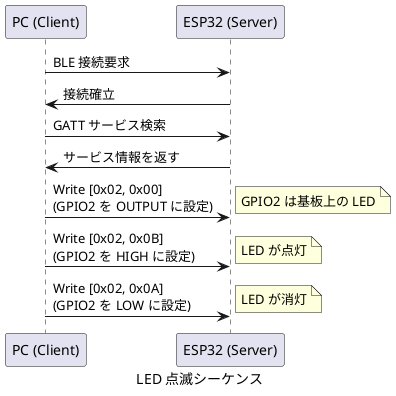
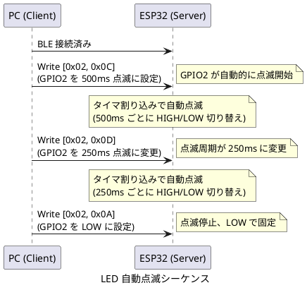
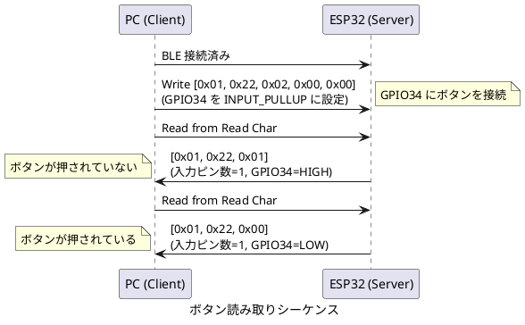
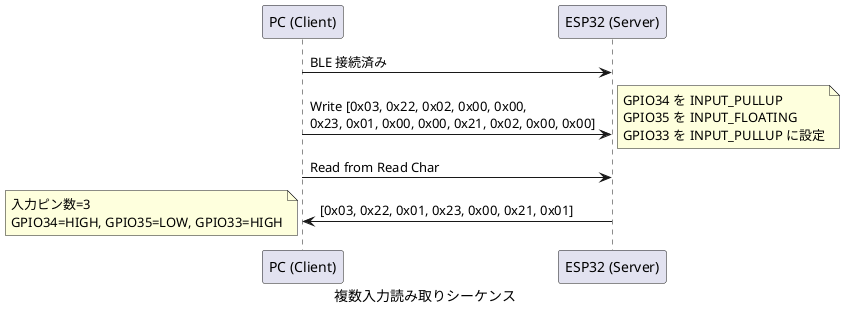

# BLEIO プロトコル仕様

本仕様は、ESP32-WROOM-32 を BLE ペリフェラル (周辺機器) として動作させ、PC などのセントラル (中心機器) から GPIO を制御するための GATT (Generic Attribute Profile) サービスを定義します。GATT は BLE における標準的なデータ交換の仕組みです。

本サービスを使うことで、ドライバをインストールせずに Windows 標準の BLE スタックから ESP32 の GPIO を直接制御できます。

## サービス情報

**サービス名**

BLEIO Service

**デバイス名**

BLEIO

**サービス UUID**

`4fafc201-1fb5-459e-8fcc-c5c9c333914b`

## キャラクタリスティック仕様

### GPIO 書き込みキャラクタリスティック

GPIO のモード設定と出力値の変更を行います。

**UUID**

`beb5483e-36e1-4688-b7f5-ea07361b26a8`

**プロパティ**

WRITE

**データ形式**

可変長配列 (最小 5 バイト、最大 97 バイト)

**全体構造**

| バイト位置 | 名称 | 型 | 説明 |
|----------|------|-----|------|
| 0 | Command Count | uint8 | コマンド個数 (1-24) |
| 1-4 | Command 1 | 4 bytes | 1つ目のコマンド |
| 5-8 | Command 2 | 4 bytes | 2つ目のコマンド (オプション) |
| ... | ... | ... | 最大 24 コマンドまで |

**各コマンドの構造 (4 バイト固定)**

| バイト位置 | 名称 | 型 | 説明 |
|----------|------|-----|------|
| 0 | Pin Number | uint8 | GPIO ピン番号 (2-39) |
| 1 | Command | uint8 | 実行するコマンド |
| 2 | Param1 | uint8 | パラメータ1 (入力コマンドではラッチモード、その他は 0x00) |
| 3 | Param2 | uint8 | パラメータ2 (将来用、現在は 0x00) |

**コマンド一覧**

| コマンド値 | 名称 | 説明 |
|----------|------|------|
| 0 | SET_OUTPUT | ピンを出力モードに設定する (※1) |
| 1 | SET_INPUT_FLOATING | ピンをハイインピーダンス入力モードに設定する |
| 2 | SET_INPUT_PULLUP | ピンを内部プルアップ付き入力モードに設定する |
| 3 | SET_INPUT_PULLDOWN | ピンを内部プルダウン付き入力モードに設定する |
| 10 | WRITE_LOW | ピンの出力を LOW (0V) に設定する (自動的に出力モードに設定される)|
| 11 | WRITE_HIGH | ピンの出力を HIGH (3.3V) に設定する (自動的に出力モードに設定される)|
| 12 | BLINK_500MS | ピンを 500ms 周期で点滅させる (自動的に出力モードに設定される)|
| 13 | BLINK_250MS | ピンを 250ms 周期で点滅させる (自動的に出力モードに設定される)|
| 20 | SET_PWM | ピンを PWM 出力モードに設定する (Param1: デューティサイクル、Param2: 周波数プリセット)|
| 30 | SET_ADC_ENABLE | ピンを ADC 入力モードに設定する (Param1: 減衰設定、Param2: 将来用)|
| 31 | SET_ADC_DISABLE | ピンの ADC 入力モードを無効化する (Param1, Param2: 未使用)|

※1 SET_OUTPUT コマンドは、直前の状態が WRITE_HIGH (コマンド 11) の場合のみ HIGH を維持し、それ以外の場合は LOW に設定されます。これにより、電源投入後に一度もコマンドが実行されていない状態 (UNSET) と、明示的に設定された状態を区別できます。

**使用例**

単一コマンドの場合

- GPIO2 を出力モードに設定する場合は `[0x01, 0x02, 0x00, 0x00, 0x00]` を送信します
  - 0x01: コマンド個数 (1個)
  - 0x02: ピン番号 (GPIO2)
  - 0x00: コマンド (SET_OUTPUT)
  - 0x00, 0x00: パラメータ (未使用)
- GPIO2 を HIGH にする場合は `[0x01, 0x02, 0x0B, 0x00, 0x00]` を送信します

複数コマンドの一括送信

- GPIO2 を出力モードに設定し、GPIO4 を HIGH にする場合は `[0x02, 0x02, 0x00, 0x00, 0x00, 0x04, 0x0B, 0x00, 0x00]` を送信します
  - 0x02: コマンド個数 (2個)
  - 0x02, 0x00, 0x00, 0x00: GPIO2 を出力モードに設定
  - 0x04, 0x0B, 0x00, 0x00: GPIO4 を HIGH に設定

### GPIO 読み取りキャラクタリスティック

すべての入力モード設定済み GPIO の現在の状態を読み取ります。

**UUID**

`1c95d5e3-d8f7-413a-bf3d-7a2e5d7be87e`

**プロパティ**

READ

**読み取りデータ形式**

可変長配列 (最小 1 バイト、最大 49 バイト)

**全体構造**

| バイト位置 | 名称 | 型 | 説明 |
|----------|------|-----|------|
| 0 | Input Count | uint8 | 入力ピン数 (0-24) |
| 1 | Pin 1 Number | uint8 | 1つ目のピン番号 |
| 2 | Pin 1 State | uint8 | 1つ目のピンの状態 (0=LOW, 1=HIGH) |
| 3 | Pin 2 Number | uint8 | 2つ目のピン番号 |
| 4 | Pin 2 State | uint8 | 2つ目のピンの状態 |
| ... | ... | ... | 最大 24 ピンまで |

**動作**

READ 操作を実行すると、SET_INPUT_FLOATING、SET_INPUT_PULLUP、SET_INPUT_PULLDOWN のいずれかで入力モードに設定されているすべての GPIO の状態が自動的に返されます。WRITE 操作は不要です。

**パケット長の計算**

- パケット長 = 1 (ピン数) + 2 × N (各ピンのデータ)
- 最小: 1 バイト (入力ピンが 0 個の場合)
- 最大: 1 + 2 × 24 = 49 バイト (入力ピンが 24 個の場合)

## 使用可能な GPIO ピン

### デジタル入出力が可能なピン

以下のピンは、入力と出力の両方に使用できます。

GPIO2, GPIO4, GPIO5, GPIO12, GPIO13, GPIO14, GPIO15, GPIO16, GPIO17, GPIO18, GPIO19, GPIO21, GPIO22, GPIO23, GPIO25, GPIO26, GPIO27, GPIO32, GPIO33

### 入力専用ピン

以下のピンは、入力としてのみ使用できます。出力モードに設定しないでください。

GPIO34, GPIO35, GPIO36, GPIO39

### 点滅機能

**概要**

コマンド 12 (BLINK_500MS) とコマンド 13 (BLINK_250MS) を使用すると、GPIO を指定した周期で自動的に点滅させることができます。点滅機能は esp_timer を使用したタイマ割り込みで実装されており、PWM 機能を持たない GPIO でも動作します。

**動作仕様**

- 点滅コマンドを受信すると、GPIO は自動的に出力モードに設定されます
- 点滅は LOW (0V) から開始され、指定された周期で HIGH と LOW を繰り返します
- 複数の GPIO を同時に異なる周期で点滅させることができます
- 点滅を停止するには、WRITE_LOW (コマンド 10) または WRITE_HIGH (コマンド 11) を送信します

**タイマ実装**

- 内部タイマは 250ms 周期で動作します
- BLINK_250MS (コマンド 13) は 250ms ごとに状態を反転します
- BLINK_500MS (コマンド 12) は 500ms ごとに状態を反転します (内部カウンタで 2 回に 1 回反転)

### 入力ラッチ機能

**概要**

入力ラッチ機能は、ホストのポーリング間隔の間に発生した瞬間的な入力変化 (スイッチの短押しなど) を検出し、記録する機能です。入力ピンを設定する際に、Param1 でラッチモードを指定できます。

**ラッチモード**

| Param1 値 | モード名 | 説明 |
|----------|---------|------|
| 0 | LATCH_MODE_NONE | ラッチなし (デフォルト、現在の GPIO レベルをそのまま返す) |
| 1 | LATCH_MODE_LOW | LOW エッジラッチ (LOW への変化を検出してラッチする) |
| 2 | LATCH_MODE_HIGH | HIGH エッジラッチ (HIGH への変化を検出してラッチする) |

**動作仕様**

- ESP32 は 10ms 周期で入力 GPIO をポーリングします
- ターゲット値 (LOW ラッチなら 0、HIGH ラッチなら 1) が 2 回連続で安定して観測されるとラッチします
- ラッチが発生すると、ホストが READ を実行した際にターゲット値を返します
- ラッチが発生していない場合は、ターゲット値の逆を返します (過渡状態での誤検出を防ぐため)
- 同じピンに対して SET_INPUT_FLOATING、SET_INPUT_PULLUP、SET_INPUT_PULLDOWN のいずれかを再度送信すると、ラッチ状態がリセットされます

**使用例**

GPIO34 を内部プルアップ付き入力モードに設定し、LOW エッジをラッチする場合

```text
[0x01, 0x22, 0x02, 0x01, 0x00]
```

- 0x01: コマンド個数 (1個)
- 0x22: ピン番号 (GPIO34 = 0x22 = 34)
- 0x02: コマンド (SET_INPUT_PULLUP)
- 0x01: Param1 (LATCH_MODE_LOW)
- 0x00: Param2 (未使用)

この設定では、GPIO34 の状態は以下のように返されます。

- ラッチ前 (スイッチが押されていない): HIGH (1) を返す (LOW ラッチのターゲットの逆)
- ラッチ後 (スイッチが一度でも押された): LOW (0) を返す
- ラッチはホストが SET_INPUT_PULLUP コマンドを再度送信するまでリセットされません

**デバウンス**

10ms ポーリング周期と 2 回連続安定検出により、20ms のデバウンス時間が確保されます。これにより、機械式スイッチのチャタリングを軽減できます。

### GPIO のデフォルト状態

**電源投入時およびリセット後の状態**

bleio-server は、起動時に GPIO の初期化を行いません。すべての GPIO は ESP32 のハードウェアデフォルト状態のままです。

一般的に、リセット後のほとんどの GPIO は以下の状態になります。

- モード: 入力モード (ハイインピーダンス)
- プルアップ/プルダウン: 無効

ただし、以下の点に注意してください。

**ストラッピングピン (GPIO0, 2, 5, 12, 15)**

これらのピンは、ブートモード選択に使用されます。起動時に内部プルアップまたはプルダウンが有効になることがあります。

**ブート時の動作**

一部の GPIO は、ブートローダーの実行中に HIGH を出力したり PWM 信号を出力したりすることがあります。リレーや MOSFET などを制御する場合は、外部プルアップ/プルダウン抵抗を使用して安全なデフォルト状態を確保してください。

**推奨事項**

GPIO の状態に依存する動作を行う前に、必ず SET_OUTPUT、SET_INPUT_FLOATING、SET_INPUT_PULLUP、または SET_INPUT_PULLDOWN コマンドでモードを明示的に設定してください。デフォルト状態は、ブートローダーやアプリケーションの起動コードによって変更される可能性があります。

### 使用を避けるべきピン

以下のピンは、システムで使用されているため、GPIO として使用できません。

**GPIO0**

ブートモード選択に使用されています。起動時に LOW にするとプログラム書き込みモードになります。

**GPIO1, GPIO3**

USB シリアル通信 (UART0) に使用されています。

**GPIO6, GPIO7, GPIO8, GPIO9, GPIO10, GPIO11**

内蔵フラッシュメモリとの通信に使用されています。これらのピンを操作するとシステムが停止します。

## エラーハンドリング

**無効なピン番号を指定した場合**

ESP32 側でコマンドを無視し、シリアルコンソールにエラーメッセージを出力します。クライアント側には応答を返しません。

**入力専用ピンに出力コマンドを送信した場合**

ESP32 側でコマンドを実行しますが、実際には出力されません。ハードウェアの制限により無効な操作となります。

**未接続状態でコマンドを送信した場合**

BLE 接続が確立されていない場合、クライアント側で例外が発生します。必ず接続を確認してからコマンドを送信してください。

**入力専用ピンに SET_INPUT_PULLUP または SET_INPUT_PULLDOWN を設定した場合**

GPIO34, 35, 36, 39 は、内部プルアップ抵抗やプルダウン抵抗を持ちません。これらのピンに SET_INPUT_PULLUP または SET_INPUT_PULLDOWN コマンドを送信してもエラーは返されませんが、プルアップ/プルダウンは有効になりません。ハイインピーダンス入力モードとして動作します。これらのピンでプルアップやプルダウンが必要な場合は、外部に 10kΩ 程度の抵抗を接続してください。

## GPIO 状態管理

BLEIO-ESP32 は、各 GPIO の現在のモードを内部で管理しています。管理される状態は以下の通りです。

| 状態 | 説明 |
|------|------|
| UNSET | モード未設定 (電源投入後、一度もコマンドが実行されていない) |
| INPUT_FLOATING | ハイインピーダンス入力モード |
| INPUT_PULLUP | 内部プルアップ付き入力モード |
| INPUT_PULLDOWN | 内部プルダウン付き入力モード |
| OUTPUT_LOW | LOW (0V) 出力モード |
| OUTPUT_HIGH | HIGH (3.3V) 出力モード |
| BLINK_250MS | 250ms 点滅出力モード |
| BLINK_500MS | 500ms 点滅出力モード |
| PWM | PWM 出力モード |
| ADC | ADC 入力モード (アナログ電圧読み取り) |

この状態管理により、SET_OUTPUT コマンドは直前の状態が OUTPUT_HIGH の場合のみ HIGH を維持し、それ以外は LOW に設定されます。

## 通信シーケンス例

### LED を手動で点滅させる



### LED を自動で点滅させる



### ボタンの状態を読み取る



### 複数入力ピンの一括読み取り



## BLE MTU とパケット長

**MTU サイズの設定**

BLEIO-ESP32 は BLE の ATT MTU (Maximum Transmission Unit) を最小限の 100 バイトに設定しています。これにより、ESP32 の使用可能な GPIO 24 個すべてを一度に制御できます。

MTU サイズは以下の計算式で導出されます。

```text
必要 MTU = ATT ヘッダ (3) + ペイロード (1 + 24 × 4)
         = 3 + 97
         = 100 バイト
```

- ATT ヘッダ: 3 バイト (Opcode 1 バイト + Attribute Handle 2 バイト)
- ペイロード: 97 バイト (コマンド個数 1 バイト + 24 コマンド × 4 バイト)

**パケット長の計算**

- 書き込み: 1 (コマンド個数) + 4 × N (各コマンド)
  - 最小: 1 + 4 = 5 バイト (1 コマンド)
  - 最大: 1 + 4 × 24 = 97 バイト (24 コマンド)
- 読み取り: 1 (入力個数) + 2 × N (各入力)
  - 最小: 1 バイト (入力ピンが 0 個)
  - 最大: 1 + 2 × 24 = 49 バイト (24 入力)

**使用可能な GPIO 数**

ESP32 で使用可能な GPIO は合計 24 個です。

- デジタル入出力: 19 個 (GPIO2, 4, 5, 12-19, 21-27, 32-33)
- 入力専用: 5 個 (GPIO34-36, 39)

**互換性**

クライアントが MTU 100 バイトをサポートしていない場合、デフォルトの MTU (23 バイト、実効 20 バイト) が使用されます。この場合、最大 4 コマンドまで送信できます。

## 拡張性

### パラメータの活用 (将来実装)

各コマンドには 2 バイトのパラメータ領域 (Param1, Param2) が用意されています。現在は未使用ですが、将来的に以下のような用途に使用できます。

**PWM 出力の例**

新しいコマンド `SET_PWM` (コマンド値 20) を追加する場合

| フィールド | 値 | 説明 |
|----------|-----|------|
| Pin Number | 2 | GPIO2 |
| Command | 20 | SET_PWM |
| Param1 | 128 | Duty Cycle (0-255、128 = 50%) |
| Param2 | 0 | 周波数の指定方法など |

### PWM 出力機能

PWM (Pulse Width Modulation) は、デジタル信号でアナログ的な出力を実現する技術です。LED の明るさ調整やモーターの速度制御に使用します。

**コマンド 20: SET_PWM**

GPIO を PWM 出力モードに設定し、デューティサイクルと周波数を指定します。

**パラメータ**

| パラメータ | 型 | 説明 |
|----------|-----|------|
| Param1 | uint8 | デューティサイクル (0-255、0 = 0%、255 = 100%) |
| Param2 | uint8 | 周波数プリセット (0-7) |

**Param1: デューティサイクル**

8 ビット値で PWM のデューティサイクル (ON 時間の割合) を指定します。

- 0: 0% (常に LOW)
- 128: 50% (半分 ON、半分 OFF)
- 255: 100% (常に HIGH)

実際のデューティサイクル = `(Param1 / 255.0) * 100%`

**Param2: 周波数プリセット**

PWM の周波数をプリセット値で指定します。

| Param2 値 | 周波数 | 用途 |
|----------|--------|------|
| 0 | 1 kHz | 一般用途 (デフォルト) |
| 1 | 5 kHz | LED 調光 (低周波、ちらつき防止) |
| 2 | 10 kHz | LED 調光 (標準) |
| 3 | 25 kHz | サーボモーター、DC モーター制御 |
| 4 | 50 Hz | サーボモーター (標準 PWM) |
| 5 | 100 Hz | 低速制御 |
| 6 | 500 Hz | 中速制御 |
| 7 | 20 kHz | 高周波 PWM (可聴域外) |

**使用例**

GPIO2 を 50% デューティサイクル、10 kHz で PWM 出力する場合

```text
[0x01, 0x02, 0x14, 0x80, 0x02]
```

- 0x01: コマンド個数 (1 個)
- 0x02: ピン番号 (GPIO2)
- 0x14: コマンド (SET_PWM = 20 = 0x14)
- 0x80: Param1 (デューティサイクル = 128 = 0x80 = 50%)
- 0x02: Param2 (周波数プリセット = 2 = 10 kHz)

**制限事項**

- 同時に PWM を使用できる GPIO は最大 8 個です (ESP32 LEDC Low Speed モードのチャネル数)
- すべての PWM 出力が同じ周波数を共有します (単一タイマー使用のため)
- 入力専用ピン (GPIO34, GPIO35, GPIO36, GPIO39) では使用できません
- PWM を停止するには、WRITE_LOW (コマンド 10) または WRITE_HIGH (コマンド 11) を送信します

### ADC 読み取りキャラクタリスティック

ESP32 は 12 ビット解像度の ADC (Analog-to-Digital Converter) を搭載しています。アナログ電圧を 0-4095 の数値に変換できます。

**UUID**

`2d8a7b3c-4e9f-4a1b-8c5d-6e7f8a9b0c1d`

**プロパティ**

READ

**読み取りデータ形式**

可変長配列 (最小 1 バイト、最大 19 バイト)

**全体構造**

| バイト位置 | 名称 | 型 | 説明 |
|----------|------|-----|------|
| 0 | ADC Count | uint8 | ADC ピン数 (0-6) |
| 1 | Pin 1 Number | uint8 | 1つ目のピン番号 |
| 2-3 | Pin 1 Value | uint16 | 1つ目のピンの ADC 値 (リトルエンディアン、0-4095) |
| 4 | Pin 2 Number | uint8 | 2つ目のピン番号 |
| 5-6 | Pin 2 Value | uint16 | 2つ目のピンの ADC 値 |
| ... | ... | ... | 最大 6 ピンまで |

**動作**

READ 操作を実行すると、SET_ADC_ENABLE で ADC モードに設定されているすべての GPIO の値が自動的に返されます。

**パケット長の計算**

- パケット長 = 1 (ピン数) + 3 × N (各ピンのデータ)
- 最小: 1 バイト (ADC ピンが 0 個の場合)
- 最大: 1 + 3 × 6 = 19 バイト (ADC ピンが 6 個の場合)

**対応ピン**

ADC1 のみ使用可能です (BLE と ADC2 は同時使用不可のため)。

- GPIO32, GPIO33, GPIO34, GPIO35, GPIO36, GPIO39 (6 ピン)

**減衰設定 (Param1)**

ADC の入力電圧範囲を減衰設定で調整できます。

| Param1 値 | 減衰 | 測定範囲 (理論値) | 用途 |
|----------|------|------------------|------|
| 0 | 0 dB | 0-1.1V | バッテリー電圧など低電圧測定 |
| 1 | 2.5 dB | 0-1.5V | 低電圧センサー |
| 2 | 6 dB | 0-2.2V | 中電圧センサー |
| 3 | 11 dB | 0-3.3V | 汎用 (デフォルト、ESP32 の電源電圧まで) |

**使用例**

GPIO32 を 11dB 減衰 (0-3.3V) で ADC 入力として有効化する場合

```text
[0x01, 0x20, 0x1E, 0x03, 0x00]
```

- 0x01: コマンド個数 (1個)
- 0x20: ピン番号 (GPIO32 = 0x20 = 32)
- 0x1E: コマンド (SET_ADC_ENABLE = 30 = 0x1E)
- 0x03: Param1 (減衰設定 = 3 = 11dB)
- 0x00: Param2 (未使用)

**読み取り例**

GPIO32 で ADC 値 2048 (約 1.65V) を読み取った場合

```text
[0x01, 0x20, 0x00, 0x08]
```

- 0x01: ADC ピン数 (1個)
- 0x20: ピン番号 (GPIO32)
- 0x00, 0x08: ADC 値 (0x0800 = 2048、リトルエンディアン)

実際の電圧 = `(2048 / 4095.0) * 3.3V ≈ 1.65V`

**制限事項**

- BLE 使用中は ADC2 (GPIO0, 2, 4, 12-15, 25-27) を使用できません
- ADC1 のみ使用可能で、最大 6 ピンです
- ADC 値の読み取りには esp_adc_cal によるキャリブレーションが適用されます

## DOIT ESP32 DevKit V1 のピン情報

[DOIT ESP32 DevKit V1](https://www.circuitstate.com/tutorials/getting-started-with-espressif-esp32-wifi-bluetooth-soc-using-doit-esp32-devkit-v1-development-board/#DOIT_ESP32_DevKit_V1) で安全に使用できる GPIO は以下の通りです。

### デジタル入出力に使用可能

- GPIO2 (基板上の LED 接続)
- GPIO4, 5, 12, 13, 14, 15, 16, 17, 18, 19, 21, 22, 23, 25, 26, 27, 32, 33 (18 ポート)

### 入力専用

- GPIO34, 35, 36, 39

### 使用を避けるべきピン

- GPIO0: ブートモード選択用
- GPIO1, 3: USB シリアル通信用
- GPIO6, 7, 8, 9, 10, 11: フラッシュメモリ接続用
