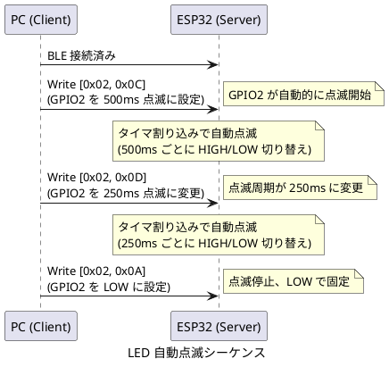
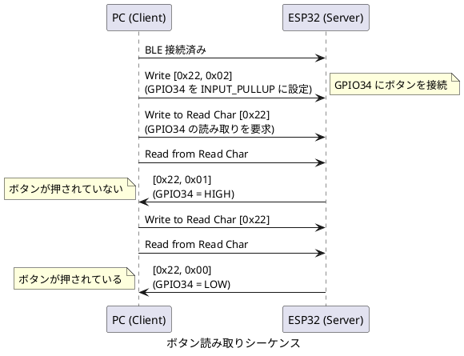

# espio プロトコル仕様

本仕様は、ESP32-WROOM-32 を BLE ペリフェラル (周辺機器) として動作させ、PC などのセントラル (中心機器) から GPIO を制御するための GATT (Generic Attribute Profile) サービスを定義します。GATT は BLE における標準的なデータ交換の仕組みです。

本サービスを使うことで、ドライバをインストールせずに Windows 標準の BLE スタックから ESP32 の GPIO を直接制御できます。

## サービス情報

**サービス名**

ESP32 GPIO Control Service

**デバイス名**

ESP32-GPIO

**サービス UUID**

`4fafc201-1fb5-459e-8fcc-c5c9c333914b`

## キャラクタリスティック仕様

### GPIO 書き込みキャラクタリスティック

GPIO のモード設定と出力値の変更を行います。

**UUID**

`beb5483e-36e1-4688-b7f5-ea07361b26a8`

**プロパティ**

WRITE

**データ形式**

2 バイトの配列

| バイト位置 | 名称 | 型 | 説明 |
|----------|------|-----|------|
| 0 | Pin Number | uint8 | GPIO ピン番号 (2-39) |
| 1 | Command | uint8 | 実行するコマンド |

**コマンド一覧**

| コマンド値 | 名称 | 説明 |
|----------|------|------|
| 0 | SET_INPUT | ピンを入力モードに設定する |
| 1 | SET_OUTPUT | ピンを出力モードに設定する (※1) |
| 2 | SET_INPUT_PULLUP | ピンを内部プルアップ抵抗付き入力モードに設定する |
| 10 | WRITE_LOW | ピンの出力を LOW (0V) に設定する (点滅中の場合は停止) |
| 11 | WRITE_HIGH | ピンの出力を HIGH (3.3V) に設定する (点滅中の場合は停止) |
| 12 | BLINK_500MS | ピンを 500ms 周期で点滅させる (自動的に出力モードに設定される) |
| 13 | BLINK_250MS | ピンを 250ms 周期で点滅させる (自動的に出力モードに設定される) |

※1 SET_OUTPUT コマンドは、直前の状態が WRITE_HIGH (コマンド 11) の場合のみ HIGH を維持し、それ以外の場合は LOW に設定されます。これにより、電源投入後に一度もコマンドが実行されていない状態 (UNSET) と、明示的に設定された状態を区別できます。

**使用例**

- GPIO2 を出力モードに設定する場合は `[0x02, 0x01]` を送信します
- GPIO2 を HIGH にする場合は `[0x02, 0x0B]` を送信します
- GPIO2 を 500ms 周期で点滅させる場合は `[0x02, 0x0C]` を送信します
- GPIO2 を 250ms 周期で点滅させる場合は `[0x02, 0x0D]` を送信します

### GPIO 読み取りキャラクタリスティック

GPIO の現在の状態を読み取ります。

**UUID**

`1c95d5e3-d8f7-413a-bf3d-7a2e5d7be87e`

**プロパティ**

READ, WRITE

**書き込みデータ形式**

1 バイトの配列

| バイト位置 | 名称 | 型 | 説明 |
|----------|------|-----|------|
| 0 | Pin Number | uint8 | 読み取りたい GPIO ピン番号 |

**読み取りデータ形式**

2 バイトの配列

| バイト位置 | 名称 | 型 | 説明 |
|----------|------|-----|------|
| 0 | Pin Number | uint8 | 読み取った GPIO ピン番号 |
| 1 | State | uint8 | ピンの状態 (0=LOW, 1=HIGH) |

**使用手順**

GPIO の状態を読み取るには、まず読み取りたいピン番号を書き込み、その後すぐに READ 操作を実行します。これにより、指定したピンの現在の状態が返されます。

## 使用可能な GPIO ピン

### デジタル入出力が可能なピン

以下のピンは、入力と出力の両方に使用できます。

GPIO2, GPIO4, GPIO5, GPIO12, GPIO13, GPIO14, GPIO15, GPIO16, GPIO17, GPIO18, GPIO19, GPIO21, GPIO22, GPIO23, GPIO25, GPIO26, GPIO27, GPIO32, GPIO33

### 入力専用ピン

以下のピンは、入力としてのみ使用できます。出力モードに設定しないでください。

GPIO34, GPIO35, GPIO36, GPIO39

### 点滅機能

**概要**

コマンド 12 (BLINK_500MS) とコマンド 13 (BLINK_250MS) を使用すると、GPIO を指定した周期で自動的に点滅させることができます。点滅機能は esp_timer を使用したタイマ割り込みで実装されており、PWM 機能を持たない GPIO でも動作します。

**動作仕様**

- 点滅コマンドを受信すると、GPIO は自動的に出力モードに設定されます
- 点滅は LOW (0V) から開始され、指定された周期で HIGH と LOW を繰り返します
- 複数の GPIO を同時に異なる周期で点滅させることができます
- 点滅を停止するには、WRITE_LOW (コマンド 10) または WRITE_HIGH (コマンド 11) を送信します

**タイマ実装**

- 内部タイマは 250ms 周期で動作します
- BLINK_250MS (コマンド 13) は 250ms ごとに状態を反転します
- BLINK_500MS (コマンド 12) は 500ms ごとに状態を反転します (内部カウンタで 2 回に 1 回反転)

### GPIO のデフォルト状態

**電源投入時およびリセット後の状態**

espio-server は、起動時に GPIO の初期化を行いません。すべての GPIO は ESP32 のハードウェアデフォルト状態のままです。

一般的に、リセット後のほとんどの GPIO は以下の状態になります。

- モード: 入力モード (ハイインピーダンス)
- プルアップ/プルダウン: 無効

ただし、以下の点に注意してください。

**ストラッピングピン (GPIO0, 2, 5, 12, 15)**

これらのピンは、ブートモード選択に使用されます。起動時に内部プルアップまたはプルダウンが有効になることがあります。

**ブート時の動作**

一部の GPIO は、ブートローダーの実行中に HIGH を出力したり PWM 信号を出力したりすることがあります。リレーや MOSFET などを制御する場合は、外部プルアップ/プルダウン抵抗を使用して安全なデフォルト状態を確保してください。

**推奨事項**

GPIO の状態に依存する動作を行う前に、必ず SET_INPUT、SET_OUTPUT、または SET_INPUT_PULLUP コマンドでモードを明示的に設定してください。デフォルト状態は、ブートローダーやアプリケーションの起動コードによって変更される可能性があります。

### 使用を避けるべきピン

以下のピンは、システムで使用されているため、GPIO として使用できません。

**GPIO0**

ブートモード選択に使用されています。起動時に LOW にするとプログラム書き込みモードになります。

**GPIO1, GPIO3**

USB シリアル通信 (UART0) に使用されています。

**GPIO6, GPIO7, GPIO8, GPIO9, GPIO10, GPIO11**

内蔵フラッシュメモリとの通信に使用されています。これらのピンを操作するとシステムが停止します。

## エラーハンドリング

**無効なピン番号を指定した場合**

ESP32 側でコマンドを無視し、シリアルコンソールにエラーメッセージを出力します。クライアント側には応答を返しません。

**入力専用ピンに出力コマンドを送信した場合**

ESP32 側でコマンドを実行しますが、実際には出力されません。ハードウェアの制限により無効な操作となります。

**未接続状態でコマンドを送信した場合**

BLE 接続が確立されていない場合、クライアント側で例外が発生します。必ず接続を確認してからコマンドを送信してください。

**入力専用ピンに SET_INPUT_PULLUP を設定した場合**

GPIO34, 35, 36, 39 は、内部プルアップ抵抗やプルダウン抵抗を持ちません。これらのピンに SET_INPUT_PULLUP コマンドを送信してもエラーは返されませんが、プルアップは有効になりません。通常の入力モードとして動作します。これらのピンでプルアップが必要な場合は、外部に 10kΩ 程度のプルアップ抵抗を接続してください。

## GPIO 状態管理

espio-server は、各 GPIO の現在のモードを内部で管理しています。管理される状態は以下の通りです。

| 状態 | 説明 |
|------|------|
| UNSET | モード未設定 (電源投入後、一度もコマンドが実行されていない) |
| INPUT | 入力モード |
| INPUT_PULLUP | 内部プルアップ抵抗付き入力モード |
| OUTPUT_LOW | LOW (0V) 出力モード |
| OUTPUT_HIGH | HIGH (3.3V) 出力モード |
| BLINK_250MS | 250ms 点滅出力モード |
| BLINK_500MS | 500ms 点滅出力モード |

この状態管理により、SET_OUTPUT コマンドは直前の状態が OUTPUT_HIGH の場合のみ HIGH を維持し、それ以外は LOW に設定されます。

## 通信シーケンス例

### LED を手動で点滅させる

### LED を自動で点滅させる

### ボタンの状態を読み取る

## 拡張性

### PWM 出力への対応 (将来実装)

PWM (Pulse Width Modulation) は、デジタル信号でアナログ的な出力を実現する技術です。LED の明るさ調整やモーターの速度制御に使用します。

将来的に PWM 機能を追加する場合は、以下のコマンドを追加することを推奨します。

| コマンド値 | 名称 | 追加パラメータ | 説明 |
|----------|------|--------------|------|
| 20 | SET_PWM_FREQ | Byte 2: 周波数 (Hz) の下位バイト Byte 3: 周波数 (Hz) の上位バイト | PWM の周波数を設定する |
| 21 | SET_PWM_DUTY | Byte 2: Duty Cycle (0-255) | PWM の Duty Cycle を設定する (0=0%, 255=100%) |
| 22 | PWM_START | なし | PWM 出力を開始する |
| 23 | PWM_STOP | なし | PWM 出力を停止する |

この場合、書き込みキャラクタリスティックのデータ長を可変長 (2-4 バイト) に変更する必要があります。

### アナログ入力への対応 (将来実装)

ESP32 は 12 ビット解像度の ADC (Analog-to-Digital Converter) を搭載しています。アナログ電圧を 0-4095 の数値に変換できます。

アナログ入力機能を追加する場合は、新しいキャラクタリスティックを追加することを推奨します。

**Analog Read Characteristic UUID (例)**

`2d8a7b3c-4e9f-4a1b-8c5d-6e7f8a9b0c1d`

**読み取りデータ形式**

| バイト位置 | 名称 | 型 | 説明 |
|----------|------|-----|------|
| 0 | Pin Number | uint8 | ADC ピン番号 |
| 1 | Value Low | uint8 | ADC 値の下位バイト |
| 2 | Value High | uint8 | ADC 値の上位バイト |

ADC 値は 12 ビット (0-4095) のため、2 バイトで表現します。実際の電圧は `(値 / 4095.0) * 3.3V` で計算できます。

## DOIT ESP32 DevKit V1 のピン情報

[DOIT ESP32 DevKit V1](https://www.circuitstate.com/tutorials/getting-started-with-espressif-esp32-wifi-bluetooth-soc-using-doit-esp32-devkit-v1-development-board/#DOIT_ESP32_DevKit_V1) で安全に使用できる GPIO は以下の通りです。

### デジタル入出力に使用可能

- GPIO2 (基板上の LED 接続)
- GPIO4, 5, 12, 13, 14, 15, 16, 17, 18, 19, 21, 22, 23, 25, 26, 27, 32, 33 (18 ポート)

### 入力専用

- GPIO34, 35, 36, 39

### 使用を避けるべきピン

- GPIO0: ブートモード選択用
- GPIO1, 3: USB シリアル通信用
- GPIO6, 7, 8, 9, 10, 11: フラッシュメモリ接続用
