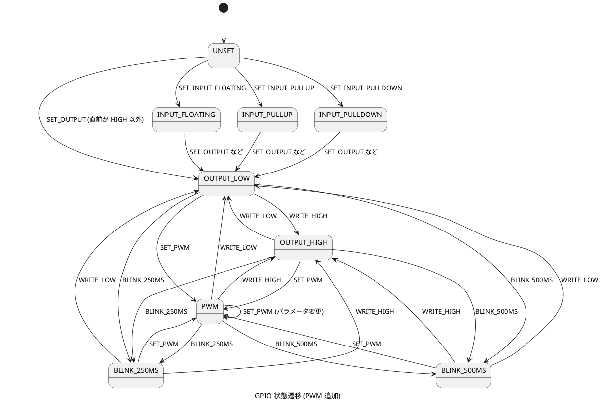

# PWM 出力機能 詳細設計

## 概要

BLEIO に PWM (Pulse Width Modulation) 出力機能を追加します。PWM は、デジタル信号でアナログ的な出力を実現する技術であり、LED の明るさ調整やモーターの速度制御に使用します。

## 設計方針

既存のプロトコル構造 (4 バイトコマンド) を維持し、Param1 と Param2 を活用して PWM 機能を実装します。MTU サイズの変更は不要です。

## プロトコル仕様

### 新しいコマンド

**SET_PWM (コマンド値 20)**

GPIO を PWM 出力モードに設定し、デューティサイクルと周波数を指定します。

**コマンド構造**

| フィールド | 型 | 説明 |
|----------|-----|------|
| Pin Number | uint8 | GPIO ピン番号 (2-39、ただし入力専用ピンを除く) |
| Command | uint8 | 20 (SET_PWM) |
| Param1 | uint8 | Duty Cycle (0-255、0 = 0%、255 = 100%) |
| Param2 | uint8 | 周波数プリセット (0-7) |

**Param1: デューティサイクル**

8 ビット値で PWM のデューティサイクル (ON 時間の割合) を指定します。

- 0: 0% (常に LOW)
- 128: 50% (半分 ON、半分 OFF)
- 255: 100% (常に HIGH)

実際のデューティサイクル = `(Param1 / 255.0) * 100%`

**Param2: 周波数プリセット**

PWM の周波数をプリセット値で指定します。

| Param2 値 | 周波数 | 用途 |
|----------|--------|------|
| 0 | 1 kHz | 一般用途 (デフォルト) |
| 1 | 5 kHz | LED 調光 (低周波、ちらつき防止) |
| 2 | 10 kHz | LED 調光 (標準) |
| 3 | 25 kHz | サーボモーター、DC モーター制御 |
| 4 | 50 Hz | サーボモーター (標準 PWM) |
| 5 | 100 Hz | 低速制御 |
| 6 | 500 Hz | 中速制御 |
| 7 | 20 kHz | 高周波 PWM (可聴域外) |

**使用例**

GPIO2 を 50% デューティサイクル、10 kHz で PWM 出力する場合

```text
[0x01, 0x02, 0x14, 0x80, 0x02]
```

- 0x01: コマンド個数 (1 個)
- 0x02: ピン番号 (GPIO2)
- 0x14: コマンド (SET_PWM = 20 = 0x14)
- 0x80: Param1 (Duty Cycle = 128 = 0x80 = 50%)
- 0x02: Param2 (周波数プリセット = 2 = 10 kHz)

## ESP32 ハードウェア仕様

### LEDC (LED Control) ペリフェラル

ESP32 は LEDC (LED Controller) ペリフェラルを使用して PWM を生成します。

**チャネル数**

- 合計 16 チャネル (High Speed: 8 チャネル + Low Speed: 8 チャネル)
- BLEIO では Low Speed モードの 8 チャネルを使用します

**分解能**

- 1 ~ 15 ビット (周波数に応じて可変)
- BLEIO では 8 ビット (256 段階) を使用します

**周波数範囲**

- Low Speed モード: 1 Hz ~ 40 MHz (分解能に依存)
- 8 ビット分解能の場合: 最大約 312 kHz

**タイマー**

- 4 個のタイマー (Low Speed モードで使用可能)
- 各タイマーに複数のチャネルを割り当て可能

### PWM 対応ピン

すべてのデジタル出力可能な GPIO で PWM を使用できます。

**対応ピン**

GPIO2, GPIO4, GPIO5, GPIO12, GPIO13, GPIO14, GPIO15, GPIO16, GPIO17, GPIO18, GPIO19, GPIO21, GPIO22, GPIO23, GPIO25, GPIO26, GPIO27, GPIO32, GPIO33

**非対応ピン**

- 入力専用ピン (GPIO34, GPIO35, GPIO36, GPIO39)

## ソフトウェア設計

### サーバー側 (ESP32)

#### データ構造

**GPIO 状態管理への追加**

既存の gpio_state_t に PWM 状態を追加します。

```c
typedef enum {
    GPIO_STATE_UNSET,
    GPIO_STATE_INPUT_FLOATING,
    GPIO_STATE_INPUT_PULLUP,
    GPIO_STATE_INPUT_PULLDOWN,
    GPIO_STATE_OUTPUT_LOW,
    GPIO_STATE_OUTPUT_HIGH,
    GPIO_STATE_BLINK_250MS,
    GPIO_STATE_BLINK_500MS,
    GPIO_STATE_PWM  // 新規追加
} gpio_state_t;
```

**PWM 設定の保持**

各 GPIO の PWM 設定を保持する構造体を追加します。

```c
typedef struct {
    uint8_t duty_cycle;      // デューティサイクル (0-255)
    uint8_t freq_preset;     // 周波数プリセット (0-7)
    ledc_channel_t channel;  // 割り当てられた LEDC チャネル (-1: 未割り当て)
} pwm_config_t;

static pwm_config_t pwm_configs[GPIO_MAX];  // GPIO ごとの PWM 設定
```

**LEDC チャネル管理**

LEDC チャネルの割り当て状況を管理します。

```c
#define LEDC_CHANNEL_MAX 8  // Low Speed モードで使用可能なチャネル数

typedef struct {
    bool in_use;             // チャネルが使用中か
    uint8_t gpio_num;        // このチャネルを使用している GPIO 番号
} ledc_channel_info_t;

static ledc_channel_info_t ledc_channels[LEDC_CHANNEL_MAX];
```

#### 周波数プリセットテーブル

```c
static const uint32_t pwm_freq_table[] = {
    1000,   // 0: 1 kHz (デフォルト)
    5000,   // 1: 5 kHz
    10000,  // 2: 10 kHz
    25000,  // 3: 25 kHz
    50,     // 4: 50 Hz (サーボモーター)
    100,    // 5: 100 Hz
    500,    // 6: 500 Hz
    20000   // 7: 20 kHz
};

#define PWM_FREQ_TABLE_SIZE (sizeof(pwm_freq_table) / sizeof(pwm_freq_table[0]))
```

#### 関数

**PWM 初期化**

```c
void pwm_init(void)
{
    // LEDC タイマー設定 (タイマー 0 を使用)
    ledc_timer_config_t timer_conf = {
        .speed_mode = LEDC_LOW_SPEED_MODE,
        .duty_resolution = LEDC_TIMER_8_BIT,  // 8 ビット (0-255)
        .timer_num = LEDC_TIMER_0,
        .freq_hz = 1000,  // デフォルト周波数 (動的に変更可能)
        .clk_cfg = LEDC_AUTO_CLK
    };
    ledc_timer_config(&timer_conf);

    // チャネル管理テーブルの初期化
    for (int i = 0; i < LEDC_CHANNEL_MAX; i++) {
        ledc_channels[i].in_use = false;
        ledc_channels[i].gpio_num = 0;
    }

    // PWM 設定の初期化
    for (int i = 0; i < GPIO_MAX; i++) {
        pwm_configs[i].duty_cycle = 0;
        pwm_configs[i].freq_preset = 0;
        pwm_configs[i].channel = -1;
    }
}
```

**チャネル割り当て**

```c
ledc_channel_t allocate_ledc_channel(uint8_t gpio_num)
{
    // 既にこの GPIO に割り当てられているチャネルがあれば再利用
    for (int i = 0; i < LEDC_CHANNEL_MAX; i++) {
        if (ledc_channels[i].in_use && ledc_channels[i].gpio_num == gpio_num) {
            return (ledc_channel_t)i;
        }
    }

    // 空きチャネルを検索
    for (int i = 0; i < LEDC_CHANNEL_MAX; i++) {
        if (!ledc_channels[i].in_use) {
            ledc_channels[i].in_use = true;
            ledc_channels[i].gpio_num = gpio_num;
            return (ledc_channel_t)i;
        }
    }

    // チャネルが不足
    return -1;
}
```

**チャネル解放**

```c
void free_ledc_channel(uint8_t gpio_num)
{
    for (int i = 0; i < LEDC_CHANNEL_MAX; i++) {
        if (ledc_channels[i].in_use && ledc_channels[i].gpio_num == gpio_num) {
            ledc_channel_stop(LEDC_LOW_SPEED_MODE, (ledc_channel_t)i, 0);
            ledc_channels[i].in_use = false;
            ledc_channels[i].gpio_num = 0;
            pwm_configs[gpio_num].channel = -1;
            break;
        }
    }
}
```

**PWM 設定**

```c
void handle_set_pwm(uint8_t pin, uint8_t duty_cycle, uint8_t freq_preset)
{
    // パラメータ検証
    if (!is_valid_output_pin(pin)) {
        ESP_LOGE(TAG, "GPIO%d は PWM 出力に対応していません", pin);
        return;
    }

    if (freq_preset >= PWM_FREQ_TABLE_SIZE) {
        ESP_LOGE(TAG, "無効な周波数プリセット: %d", freq_preset);
        return;
    }

    // 既存のモードをクリーンアップ
    if (gpio_states[pin] == GPIO_STATE_BLINK_250MS ||
        gpio_states[pin] == GPIO_STATE_BLINK_500MS) {
        stop_blink(pin);  // 点滅タイマーを停止
    }

    if (gpio_states[pin] == GPIO_STATE_PWM) {
        free_ledc_channel(pin);  // 既存の PWM を停止
    }

    // LEDC チャネルを割り当て
    ledc_channel_t channel = allocate_ledc_channel(pin);
    if (channel < 0) {
        ESP_LOGE(TAG, "LEDC チャネルが不足しています (最大 %d チャネル)", LEDC_CHANNEL_MAX);
        return;
    }

    // 周波数を設定 (タイマー 0 を使用)
    uint32_t freq_hz = pwm_freq_table[freq_preset];
    ledc_timer_config_t timer_conf = {
        .speed_mode = LEDC_LOW_SPEED_MODE,
        .duty_resolution = LEDC_TIMER_8_BIT,
        .timer_num = LEDC_TIMER_0,
        .freq_hz = freq_hz,
        .clk_cfg = LEDC_AUTO_CLK
    };
    ledc_timer_config(&timer_conf);

    // チャネルを設定
    ledc_channel_config_t channel_conf = {
        .gpio_num = pin,
        .speed_mode = LEDC_LOW_SPEED_MODE,
        .channel = channel,
        .intr_type = LEDC_INTR_DISABLE,
        .timer_sel = LEDC_TIMER_0,
        .duty = duty_cycle,  // 8 ビット値 (0-255)
        .hpoint = 0
    };
    ledc_channel_config(&channel_conf);

    // 設定を保存
    pwm_configs[pin].duty_cycle = duty_cycle;
    pwm_configs[pin].freq_preset = freq_preset;
    pwm_configs[pin].channel = channel;
    gpio_states[pin] = GPIO_STATE_PWM;

    ESP_LOGI(TAG, "GPIO%d を PWM 出力に設定しました (デューティ: %d/255, 周波数: %d Hz)",
             pin, duty_cycle, freq_hz);
}
```

**コマンド処理への追加**

既存の handle_gpio_command 関数に SET_PWM コマンドを追加します。

```c
void handle_gpio_command(uint8_t pin, uint8_t cmd, uint8_t param1, uint8_t param2)
{
    switch (cmd) {
        case 0:  // SET_OUTPUT
            // ... 既存のコード ...
            break;
        // ... 他の既存コマンド ...
        case 20:  // SET_PWM
            handle_set_pwm(pin, param1, param2);
            break;
        default:
            ESP_LOGW(TAG, "未知のコマンド: %d", cmd);
            break;
    }
}
```

**PWM 停止**

他のコマンド (WRITE_LOW, WRITE_HIGH など) を受信したときに PWM を自動停止します。

```c
void stop_pwm_if_active(uint8_t pin)
{
    if (gpio_states[pin] == GPIO_STATE_PWM) {
        free_ledc_channel(pin);
        ESP_LOGI(TAG, "GPIO%d の PWM を停止しました", pin);
    }
}
```

各コマンドハンドラの冒頭で stop_pwm_if_active を呼び出します。

### クライアント側 (C#)

#### PwmFrequency 列挙型

```csharp
public enum PwmFrequency : byte
{
    Freq1kHz = 0,      // 1 kHz (デフォルト)
    Freq5kHz = 1,      // 5 kHz (LED 調光)
    Freq10kHz = 2,     // 10 kHz (LED 調光、標準)
    Freq25kHz = 3,     // 25 kHz (モーター制御)
    Freq50Hz = 4,      // 50 Hz (サーボモーター)
    Freq100Hz = 5,     // 100 Hz (低速制御)
    Freq500Hz = 6,     // 500 Hz (中速制御)
    Freq20kHz = 7      // 20 kHz (高周波、可聴域外)
}
```

#### SetPwmAsync メソッド

```csharp
/// <summary>
/// GPIO ピンを PWM 出力モードに設定します
/// </summary>
/// <param name="pin">GPIO ピン番号 (2-39、入力専用ピンを除く)</param>
/// <param name="dutyCycle">デューティサイクル (0.0-1.0、0.0 = 0%, 1.0 = 100%)</param>
/// <param name="frequency">PWM 周波数プリセット</param>
public async Task SetPwmAsync(byte pin, double dutyCycle, PwmFrequency frequency = PwmFrequency.Freq1kHz)
{
    EnsureConnected();

    // デューティサイクルの範囲チェック
    if (dutyCycle < 0.0 || dutyCycle > 1.0)
    {
        throw new ArgumentOutOfRangeException(nameof(dutyCycle),
            "デューティサイクルは 0.0 から 1.0 の範囲で指定してください");
    }

    // 0.0-1.0 を 0-255 に変換
    byte dutyCycleByte = (byte)Math.Round(dutyCycle * 255);

    // コマンドを送信 (コマンド 20: SET_PWM)
    await SendCommandsAsync(new[] {
        new GpioCommand(pin, 20, dutyCycleByte, (byte)frequency)
    });
}
```

#### 使用例コメント

```csharp
// GPIO2 を 50% デューティサイクル、10 kHz で PWM 出力
await client.SetPwmAsync(2, 0.5, BleioClient.PwmFrequency.Freq10kHz);

// GPIO4 を 75% デューティサイクル、デフォルト周波数 (1 kHz) で PWM 出力
await client.SetPwmAsync(4, 0.75);

// PWM を停止する場合は LOW または HIGH を書き込む
await client.DigitalWriteAsync(2, false);
```

## 状態遷移

### GPIO 状態遷移図



## 制限事項

### 同時使用可能な PWM チャネル数

最大 8 個の GPIO で同時に PWM を使用できます。これは ESP32 の LEDC Low Speed モードのチャネル数 (8 個) に制限されます。

9 個目の GPIO に PWM を設定しようとすると、エラーメッセージがシリアルコンソールに出力され、コマンドは無視されます。

### 周波数の共有

すべての PWM 出力が同じタイマー (LEDC_TIMER_0) を共有するため、周波数は最後に設定された値が適用されます。異なる GPIO で異なる周波数を同時に使用することはできません。

将来的に複数のタイマーを使用することで、この制限を緩和できます (最大 4 つの異なる周波数を同時使用可能)。

### デューティサイクルの分解能

8 ビット (256 段階) のため、0.39% 刻みでデューティサイクルを設定できます。より高精度が必要な場合は、分解能を 10 ビット (1024 段階) や 12 ビット (4096 段階) に変更できますが、最大周波数が低下します。

### 入力専用ピンでは使用不可

GPIO34, GPIO35, GPIO36, GPIO39 は入力専用のため、PWM 出力には使用できません。

## テストケース

### 基本機能テスト

1. GPIO2 を 50% デューティサイクル、1 kHz で PWM 出力
2. GPIO2 を 25% デューティサイクル、10 kHz で PWM 出力 (周波数変更)
3. GPIO2 を 75% デューティサイクル、10 kHz で PWM 出力 (デューティサイクル変更)
4. GPIO2 に WRITE_LOW を送信して PWM 停止を確認

### 複数チャネルテスト

1. GPIO2, GPIO4, GPIO5 を同時に異なるデューティサイクルで PWM 出力
2. すべての GPIO で同じ周波数が使用されることを確認
3. 8 個の GPIO で同時に PWM 出力
4. 9 個目の GPIO で PWM を設定し、エラーが返されることを確認

### 状態遷移テスト

1. GPIO2 を OUTPUT_LOW に設定
2. GPIO2 を PWM に変更
3. GPIO2 を BLINK_250MS に変更 (PWM が停止することを確認)
4. GPIO2 を PWM に変更 (点滅が停止することを確認)

### エッジケーステスト

1. デューティサイクル 0% (常に LOW) を設定
2. デューティサイクル 100% (常に HIGH) を設定
3. 入力専用ピン (GPIO34) に PWM を設定してエラーを確認
4. 無効な周波数プリセット (8 以上) を指定してエラーを確認

## 実装の優先順位

### Phase 1: 基本 PWM 機能

- サーバー側の LEDC 初期化
- SET_PWM コマンドの実装 (単一タイマー使用)
- チャネル割り当て/解放の実装
- 状態管理への PWM 状態追加

### Phase 2: クライアント側対応

- PwmFrequency 列挙型の追加
- SetPwmAsync メソッドの実装
- サンプルプログラムの追加

### Phase 3: ドキュメント更新

- protocol.md の更新 (SET_PWM コマンド仕様の追加)
- INDEX.md の更新 (クライアント API の追加)
- 使用例とシーケンス図の追加

### Phase 4 (将来拡張): 複数タイマー対応

- 最大 4 つの異なる周波数を同時使用可能にする
- 周波数ごとにタイマーを自動割り当て
- チャネル管理の拡張

## 参考資料

**ESP-IDF LEDC API リファレンス**

https://docs.espressif.com/projects/esp-idf/en/latest/esp32/api-reference/peripherals/ledc.html

**PWM の基礎**

PWM は、一定周期でデジタル信号の ON/OFF を切り替えることで、平均電圧を制御する技術です。

- 周波数 (Frequency): 1 秒間に繰り返される ON/OFF サイクルの回数 (Hz)
- デューティサイクル (Duty Cycle): 1 サイクル中の ON 時間の割合 (%)
- 分解能 (Resolution): デューティサイクルを何段階で設定できるか (ビット数)

**使用例**

- LED 調光: 5-20 kHz (人間の目にちらつきが見えない周波数)
- サーボモーター: 50 Hz (20ms 周期、1-2ms のパルス幅で角度を制御)
- DC モーター速度制御: 1-25 kHz
